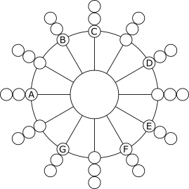
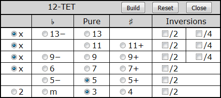

@numbering {
    enable: false
}

{title}Microtonal Music Study with Chromatic Lattice Keyboard

[*Sergey A Kryukov*](https://www.SAKryukov.org)

A pure Web browser application as a tool for advanced music harmony study in different tone systems 

<!-- <h2>Contents</h2> is not Markdown element, just to avoid adding it to TOC -->
<!-- change style in next line <ul> to <ul style="list-style-type: none"> -->
<!--
For CodeProject, makes sure there are no HTML comments in the area to past!


266D ♭music flat sign
266E ♮ music natural sign
266F ♯ music sharp sign
¹²
C &mdash; D♭² &mdash; Db &mdash; C♯ &mdash; C♯² &mdash; D 

--> 

---

<!-- copy to CodeProject from here ------------------------------------------->

<p id="image.title">


</p>

## Contents{no-toc}

@toc

## Introduction

This is the second article  in the series dedicated to musical study using specialized keyboards based on the computer keyboard:

1. *[Musical Study with Isomorphic Computer Keyboard](https://www.codeproject.com/Articles/1201737/Musical-Study-with-Isomorphic-Computer-Keyboard)*
2. Present article
3. *[Sound Builder, Web Audio Synthesizer](https://www.codeproject.com/Articles/5268512/Sound-Builder)*
 
 In my [first article](https://www.codeproject.com/Articles/1201737/Musical-Study-with-Isomorphic-Computer-Keyboard) of this series, I tried to explain very basic mathematical and physical aspects of music and put forward a keyboard structured to be very suggestive of music harmony. However, the application illustrates everything based on a much less general case of the [common-practice](https://en.wikipedia.org/wiki/Common_practice_period) [tone system](https://en.wikipedia.org/wiki/Musical_tuning).

The present and next article introduce the browser-based platform for microtonal music study, composers' experiments, and more, called [Microtonal Fabric](https://github.com/SAKryukov/microtonal-fabric).

The present article describes two Microtonal Fabric applications. The first one corresponds to the topic described by the title of the article, it is called Multi-EDO Chromatic Lattice; its source code can be found in "Multi-EDO".

The name "Microtonal Fabric" was created after these two applications were published. Its word "Fabric" is associated with two things. First, this is a matter of music, its material structure. Second, it suggests that the product is not only a set of browser applications sharing some common code. It is actually a platform for the *fabrication* of the applications, implementing any thinkable musical tonal systems, tunings, and keyboard layouts.

The microtonal keyboard I've proposed provides more flexible ways for the very basic study of the field. I will often refer to certain points in my previous article. In the present article, I'm not going to get into theoretical reasoning much, mostly because my own study of microtonal music is only starting.

The second application is the auxiliary one used for the study and the comparison of different tonal systems, the source code can be found in "tone-system-comparison". It is useful for understanding how different EDO systems work. In particular, it can be used to play and listen to the chords to detect the compromised harmonic quality of the traditional present-day *common practice* [12-EDO system](https://en.xen.wiki/w/12edo).

Here, "EDO" stands for "Equal Division of Octave" on a *logarithmic scale*. For example, the 12-EDO means the most widely used equal division of the octave into 12 "semitone" intervals. An alternative term is "12-TET", it stands for "twelve-tone equal temperament". Some authors do not consider EDO and TET terminology equivalent on the following basis: the term EDO does not imply [*"temperament"*](https://en.wikipedia.org/wiki/Musical_temperament), because if we simply divide the octave into an arbitrary number of intervals, we can obtain intervals between tones that are very far from harmonical intervals. However, in this article we are going to consider only the tonal systems which approximate the harmonical intervals very well, so they can be considered temperaments.

See also [my page](https://en.xen.wiki/w/Sergey_A_Kryukov) at the microtonal community Web site [Xenharmonic Wiki](https://en.xen.wiki). In addition to the Microtonal Fabric links, there are some useful links on different microtonal topics and personalities.

## Live Play

The ready-to-play applications, presently available in Microtonal Fabric can be found on the [Microtonal Fabric main documentation page](https://sakryukov.github.io/microtonal-fabric). One can try out the applications and play music directly in a Web browser.

The application discussed in the present article is named [Multi-EDO Chromatic Lattice and can be played here](https://sakryukov.github.io/microtonal-fabric/code/Multi-EDO).

Another application discussed in this article is the application for [Microtonal System Comparison](https://sakryukov.github.io/microtonal-fabric/code/tone-system-comparison).

## Why Microtonal?

There can be very [many answers](https://en.xen.wiki) to this question. Not trying to cover the topic, I'll try to point out four aspects I consider the most fundamental:

1. Traditional Western [equal temperament](https://en.wikipedia.org/wiki/Equal_temperament) system [12-EDO](https://en.xen.wiki/w/12edo) faces serious problems. Strictly speaking, its harmony does not sound quite harmonically. The basic sense of harmony is based on fundamental physical and mathematical principles independent of a particular culture. At the same time, [transpositional equivalence](https://en.wikipedia.org/wiki/Transposition_%28music%29#Transpositional_equivalence) is impossible to achieve with strict harmonics -- in my previous article, [I tried to explain it](https://www.codeproject.com/Articles/1201737/Musical-Study-with-Isomorphic-Computer-Keyboard#heading.rational-and-irrational-numbers). However, hearing the defects require a pretty well-trained ear. So, here is the first principle: with microtonal systems, it's possible to play music, which sounds very traditional, but more with improved harmony. At the same time, it's possible to play something very different and unusual. 

1. The historical musical instrument tuning and tonal systems can be considered microtonal in the following sense: they cannot be rendered using the modern common practice approach and the 12-tonal system, 12-EDO. However, they cannot be approximated very well using microtonal systems. Those historical systems are usually more refined in terms of musical harmony. The problem with these systems is the fixed tonality of a music piece, and the lack of *transpositional equivalence*, so arbitrary [*transposition*](https://en.wikipedia.org/wiki/Transposition_(music)) is impossible.
The rendering of historical tonal systems can be considered as actual, in particular, for so-called [*historically informed performance*](https://en.wikipedia.org/wiki/Historically_informed_performance).

1. In non-Western cultures, the microtonal approach is more actual. Traditional tuning systems can have more tones than twelve, they can use different principles rather than EDO. Microtonal Fabric helps to render any of those systems. For example, the application Microtonal Playground (source code: "playground") contains the implementation of Indian [sruti](https://en.wikipedia.org/wiki/Shruti_(music)), traditional Chinese, and other systems. Microtonal Playground deserves a separate article.

1. How about the possibility to create new music? At first glance, it may sound impossible. I often heard from people, including musicians, that such music is awful and "out of tune". Is it, really? I think, it depends. It can sound totally [xenharmonic](https://en.wikipedia.org/wiki/Xenharmonic_music), but it actually depends on the listener. The ability to perceive microtonal music can be limited by too strong bonding with the current cultural environment. The musical sense is a complicated combination of fundamental laws of nature and culture — I also [tried to explain it](https://www.codeproject.com/Articles/1201737/Musical-Study-with-Isomorphic-Computer-Keyboard#heading.culture-versus-physics), very roughly. It simply means that understanding anything which can be called "music" always required involvement in culture and considerable listening experience. Microtonal music just needs involvement in a wider cultural context and more experience.

## Supported Tone Systems

The application Multi-EDO Chromatic Lattice supports the following systems:

- [Just Intonation](https://en.wikipedia.org/wiki/Just_intonation) (only [presented by the Multi-EDO Chromatic Lattice application](https://sakryukov.github.io/microtonal-fabric/code/tone-system-comparison) on the [chromatic-circle](https://en.wikipedia.org/wiki/Chromatic_circle) keyboard)
- [Common-practice](https://en.wikipedia.org/wiki/Common_practice_period) system [12-EDO](https://en.xen.wiki/w/12edo)
- [19-EDO](https://en.wikipedia.org/wiki/19_equal_temperament)
- [31-EDO](https://en.wikipedia.org/wiki/31_equal_temperament).

[29-EDO](https://en.wikipedia.org/wiki/19_equal_temperament) is supported by a separate application (source code: "29-EDO"). This application is more advanced and is currently used for teaching music in the famous international Brainin school of music on a regular basis. It deserves a separate article.

Any arbitrary tonal systems can be created using Microtonal Playground (source code: "playground"),

## Features
- For three chromatic tone systems, the same keyboard is used; the choice of tone system can be changed dynamically
- Due to the very special keyboard layout, basic playing skills acquired and techniques learned for one tone system are immediately applicable to other tone systems
- Side-by-side comparison of the sound of tones and chords in different tone systems
- Choice of 5 instruments or 4 basic waveforms
- Chord generation
- Optional chord visualization
- Compatible browsers include, but are not limited to Google Chrome, Mozilla Firefox, Mozilla SeaMonkey, and Opera.

Since v.&thinsp;4.0:
- Touch screen support. With a touch screen, one can play with ten fingers, any chords, and *glissando* (important) in any combination.

## Using the Application

The applications presented in this article are two independent [single-page applications](https://en.wikipedia.org/wiki/Single-page_application).

1. [Microtonal Tone Systems Comparison](https://sakryukov.github.io/microtonal-fabric/code/tone-system-comparison) based on four chromatic-circle keyboards. Chords can be defined directly on the chromatic-circle keyboard and played separately in fast succession comparison.
2. [Multi-EDO Chromatic Lattice](https://sakryukov.github.io/microtonal-fabric/code/Multi-EDO) keyboard, which allows playing a wide range of tones. Chords can be defined through chord tables, auto-generated, and played with a single click or key press. 

The full source code can be downloaded, but there is no need to download software to use it — everything can be played directly on the [main Microtonal Fabric documentation page](https://sakryukov.github.io/microtonal-fabric).

### Microtonal Tone Systems Comparison

On the [Microtonal System Comparison page](https://sakryukov.github.io/microtonal-fabric/code/tone-system-comparison), all the round shapes can be used as musical instrument keys. Lower octaves are closer to the center.
Central areas are used to play chords. The round shapes at the center are hidden and are visualized when at least one note is added to a chord. Shift+note toggles a note of a chord (double click to clear the chord). For example, the [picture on the top](#image.title) shows an inversion of the harmonic seventh chord, at the moment of playing, in the [31-EDO](https://en.wikipedia.org/wiki/31_equal_temperament) system. 

The chords can be played by clicking at the centers of the round areas. Besides, if more than two chords are selected, two different temperaments can be listened to in fast alteration on the special control "<u>C</u>ompare (Ctrl+ &larr; &rarr;)". When sound is activated, moving a mouse pointer between two halves quickly alters the chords:


Now, let's consider the circular keyboards to be used for the study of different tone systems.

[Just Intonation](https://en.wikipedia.org/wiki/Just_intonation) compared with 12-EDO (gray):<br/>


Just intonation is shown in comparison with the positions of [Common-practice](https://en.wikipedia.org/wiki/Common_practice_period) [12-EDO](https://en.xen.wiki/w/12edo) *semitones* depicted as gray radial lines. This picture reveals the bigger problem of tuning accuracy of 12-EDO: pure rendering of the 6th and, even more importantly, 3rd, which is the central note of the very important [major chord](https://en.wikipedia.org/wiki/Major_chord). The errors are 15.6 [cents](https://en.wikipedia.org/wiki/Cent_%28music%29) for the 6th and 13.7 for the 3rd. Most probably people can hear the pretty subtle difference, perhaps after certain training, but the difference becomes more apparent in cases where inter-string resonances of the instruments (like piano or guitar) are noticeable.

Note that [Just Intonation](https://en.wikipedia.org/wiki/Just_intonation) is based on pure [harmonic relationships]((https://www.codeproject.com/Articles/1201737/Musical-Study-with-Isomorphic-Computer-Keyboard#heading.rational-and-irrational-numbers)) between tones, is very important for comparison of tone systems, but is fairly impractical for the playing of most musical pieces due to the lack of [transpositional equivalence](https://en.wikipedia.org/wiki/Transposition_%28music%29#Transpositional_equivalence).

[12-EDO](https://en.xen.wiki/w/12edo):<br/>


[19-EDO](https://en.wikipedia.org/wiki/19_equal_temperament):<br/>


With [19-EDO](https://en.wikipedia.org/wiki/19_equal_temperament), two different intervals between the degrees of the [major scale](https://en.wikipedia.org/wiki/Major_scale): 2 (for B-C and E-F intervals) or 3 microtones. So, there is only one kind of sharp and one kind of flat, &plusmn;1 microtone. However, I avoid using ♯ and ♭ inside minor second intervals, to avoid the choice between [enharmonically equivalent](https://en.wikipedia.org/wiki/Enharmonic) notations, because, in microtonal systems, enharmonic equivalence generally cannot be assumed -- it is not the case for the 3-microtone minor second intervals.

[31-EDO](https://en.wikipedia.org/wiki/31_equal_temperament):<br/>


With [31-EDO](https://en.wikipedia.org/wiki/31_equal_temperament), there are two sharp and flat intervals, 2 and 4 microtones. The "inverted" order of ♯ and ♭ is not a mistake, because they are sharp and flat based on different notes. For example, all the tones in C to D and B to C intervals are:

C &mdash; D♭² &mdash; Db &mdash; C♯ &mdash; C♯² &mdash; D
B &mdash; C♭ &mdash; B♯ &mdash; C

Here, I denoted "double flat" (also known as half-sharp if counted from C) as D♭² and (also known as half-flat if counted from D) C♯². The Unicode characters for half/double sharp/flat are not standardized (and many other characters for musical notation are not implemented by default on most systems), so I decided to use my own notation, which is not shown on small keys.

This way, there is only one kind of ♯ and one kind of ♭: &plusmn;2 microtones.

So, there are two different intervals between the degrees of the [major scale](https://en.wikipedia.org/wiki/Major_scale): either 5 or 3 (between B and C and between E and F) microtones. It makes 31 microtones and very good rendering of the [major scale](https://en.wikipedia.org/wiki/Major_scale). At the same time altered intervals and chords can sound very differently.  

<p id="special-chord-tables">
Another way to define a chord is based on the degrees of the scale, which can be chosen from a table.
</p>

This is the example of the table for [19-EDO](https://en.wikipedia.org/wiki/19_equal_temperament) showing the default selection of [major chord](https://en.wikipedia.org/wiki/Major_chord):


For [31-EDO](https://en.wikipedia.org/wiki/31_equal_temperament), the table is wider, because two more columns are added: "Double ♯" and "Double ♭".

For [Just Intonation](https://en.wikipedia.org/wiki/Just_intonation) and [12-EDO](https://en.xen.wiki/w/12edo), I imposed some constraints to keep the chords matching the definition of a "valid" chord accepted as a modern music term. For example, for [12-EDO](https://en.wikipedia.org/wiki/Equal_temperament) there major/minor/diminished/augmented triad is always either present or replaced with sus2 or sus4 — look at the last line:



This is not the case for microtonal systems. For consistency, generalization, and simplification, any subset of notes can be chosen, even the empty set, but no more than one alteration per zone. Note that the 6th and 7th zones are not united for microtonal systems, because generally there is no [enharmonically equivalent](https://en.wikipedia.org/wiki/Enharmonic) between 6th and 7&minus;; for the same reasons, there are no empty table cells for altered notes.

The chord [inversions](https://en.wikipedia.org/wiki/Inversion_(music)) are created by the check boxes "/2" and "/4", which lower notes by one or two octaves. 

The same system of chord selection, based on shared JavaScript code, is used for the "big" chromatic lattice keyboard. Such selection provides the only way to play a chord in one click.

### Microtonal Chromatic Lattice

Basically, the idea of the lattice is based on the [Wicki-Hayden layout](https://en.wikipedia.org/wiki/Wicki-Hayden_note_layout), but the geometry is different. Instead of being hexagonal, it is rectangular, which is simpler and better matches the symmetry of the grid of tone relationships.

The keyboard takes the same share, dimensions, and structure as the one offered in the [previous article](https://www.codeproject.com/Articles/1201737/Musical-Study-with-Isomorphic-Computer-Keyboard). Its *fragment* is shown for [31-EDO](https://en.wikipedia.org/wiki/31_equal_temperament):


The green area is used to play part of the tones using the physical computer keyboard (sorry, modeled based on standard US keyboard layout, without any options; anyone who needs something else is welcome to address me).

The controls are different. First of all, one of the three tonal systems and four layouts ([12-EDO](https://en.xen.wiki/w/12edo), 12-EDO in [Jankó layout](https://en.wikipedia.org/wiki/Jank%C3%B3_keyboard), [19-EDO](https://en.wikipedia.org/wiki/19_equal_temperament), and [31-EDO](https://en.wikipedia.org/wiki/31_equal_temperament)) can be chosen at any time.

Other controls enable optional highlighting of chords (played prefixed with Ctrl+) that are chosen from the tables [described above](#special-chord-tables) and chord note marking using the scale degree notation.

First surprising thing is that the tone layout looks nearly identical to that of 12-EDO. This layout is very special: 1) it is very suggestive of harmonic relationship between notes; 2) the layouts for different tone systems are "locally identical". The differences become apparent, for example, in the attempt to perform [harmonic modulation](https://en.wikipedia.org/wiki/Modulation_%28music%29), which is very easy though, due to the chromatic nature of the keyboard. How does it work?

Here is how the layout is structured:


The intervals in semitones depend on the tone system:

<table class="grid">
<tr>
<td>12-EDO</td><td>K=2</td><td>L=5</td><td>M=7</td>
</tr>
<tr>
<td>19-EDO</td><td>K=3</td><td>L=8</td><td>M=11</td>
</tr>
<tr>
<td>31-EDO</td><td>K=5</td><td>L=13</td><td>M=18</td>
<tr>
</table>

Obviously, the ratio values 3/2, 4/3, and 9/8 are only approximated by microtonal intervals, because rational frequency ratio values are [impossible with equal temperaments](https://www.codeproject.com/Articles/1201737/Musical-Study-with-Isomorphic-Computer-Keyboard#heading.rational-and-irrational-numbers).

## Implementation

The implementation section does not cover all the Microtonal Fabric techniques, it is only focused on some key or interesting aspects relevant to the two applications described in the present articles. Some may need a separate article to cover.

### Why Start Button?

Both applications have "Start" or power-on  buttons. Before the user clicks the button, nothing playable is visualized. Why? Basically, this is done to avoid the loss of the very first note played by the user. It would happen due to Web Audio *autoplay blocking*. The audio is available only after the user has interacted with the site (by clicking, tapping, pressing keys, etc.) Please see the [autoplay documentation] for more detail.

The major part of the initialization of the Microtonal Fabric application happens in response to the click on this button. In particular, the keyboards become visible, and [AudioContext](https://developer.mozilla.org/en-US/docs/Web/API/AudioContext) is initialized. If `AudioContext` was initialized before the first user input event, the very first sound activation would have been ignored by the Web Audio system.
h
### Sound Synthesis

Firstly, sound synthesis is totally based on [Web Audio API](https://developer.mozilla.org/en-US/docs/Web/API/Web_Audio_API) implemented by nearly all major browsers. Presently, it is based on the [W3C working draft of August 2017](https://webaudio.github.io/web-audio-api).

Since v.&thinsp;5.0, the synthesis is fully based on the code of Sound Builder and the instrument data it generates. Please see the [article on Sound Builder](https://www.codeproject.com/Articles/5268512/Sound-Builder) for further detail.

### Sound Quality

Because of the problems explained above, I would consider the quality as basically acceptable, but far from decent. First of all, I just failed to find a sufficient number of good samples. I would gladly try to use any data or advice. Perhaps sample-free synthesis of sounds from scratch. Perhaps the sample-free synthesis of sounds from scratch based on [Web Audio API](https://developer.mozilla.org/en-US/docs/Web/API/Web_Audio_API) would be more suitable.

### Scalable Vector Graphics

The on-screen keyboards of the Mictotonal Fabric applications use Scalable Vector Graphics based on embedded `<svg>` [elements](https://developer.mozilla.org/en-US/docs/Web/API/SVGGElement). The applications use two methods of keyboard initialization.

The first method is based on the visual development of the keyboard. The entire keyboard is prepared using some kind of vector graphics editor. I use and recommend open-source [InkScape](https://en.wikipedia.org/wiki/Inkscape). In the code, the keyboard is initialized based on pre-created SVG elements.

The second method is the programmatic population of the empty or dynamically created `<svg>` element.

For different applications, both methods are useful. Let's discuss them.

#### Visual Development

This method can be useful for *ad-hoc* programming when the keyboard is somewhat irregular and not too big. It is used for the tone system comparison application.

When a keyboard is created with a vector graphics editor, it can be cleaned up: redundant metadata and identifiers can be removed, and the elements to be used in the code should be named consistently. Besides, numeric colors should better be replaced with suitable CSS names. Not all elements need to be identified with the `id` attribute; the references to most of them can be obtained via enumeration. This technique is shown in the source code file "tone-system-comparison/main-circular.js":

```{lang=JavaScript}{id=code.svg.visual}
const populateKeyboard = function (keyboard, chordActivator, toneSet, tonalSystem) {

    const frequencyArray = [];
    const keyMap = new Map();

    let instrument;
    const soundHandler = (key, on) =&gt; {
        instrument.play(on, keyMap.get(key).index);
    }; //soundHandler

    chordActivator.chord = { count: 0 };

    const octaveGroups = [];
    for (let node of keyboard.childNodes) {
        if (node.constructor != SVGGElement) continue;
        let circleCount = 0;
        for (let circle of node.childNodes)
            if (circle.constructor == SVGCircleElement)
                circleCount++;
        if (circleCount &gt; 5) {
            const octave = [];
            for (let circle of node.childNodes)
                if (circle.constructor == SVGCircleElement)
                    octave.push(circle);
            octaveGroups.push(octave);
        } //if
    } //loop counting

    // populate keyboard with event handlers, etc.

};
```

The references to the elements identified by their `id` attribute can be best obtained using [`Document.querySelector`](https://developer.mozilla.org/en-US/docs/Web/API/Document/querySelector).

#### Programmatical Development

Programmatical SVG development is much more maintainable in most cases, especially when graphics is more complicated and regular, which is the case for musical keyboards that are built based on some regular tonal system. Therefore, it is used for the Multi-EDO Chromatic Lattice application.

The skeleton sample of the SVG population is shown in "Multi-EDO/keyboard.js":

```{lang=JavaScript}{id=code.svg.programmatical}
"use strict";

const keyboard = (definitionSet) =&gt; {

    const svgPreparer = (function (svg) {
        const findNamespace = () =&gt; {
            for (let index in svg.attributes) {
                const attribute = svg.attributes[index];
                if (attribute.localName == "xmlns:svg")
                    return attribute.value;
            } // loop
        } //findNamespace
        const namespace = findNamespace(svg);
        return { svg: svg, elementCreator: (tagName) =&gt; {
            return document.createElementNS(namespace, tagName); } };
    })(definitionSet.elements.keyboard);
        
    const keyboardStructure = { rows: []};

    const svg = svgPreparer.svg;

    svg.style.display = "none"; // to be visualized after initialization

    // populate keyboardStructure with keys, using svgPreparer
    // ...

    return keyboardStructure;

};
```
Keyboard structure is used to create a keyboard event handler, see "multi-EDO/keyboard-handler.js" for the detail.

For detail, please see the complete source code.

### Compatibility

At the moment of writing, Web Audio API exists as a W3C editor's [draft of 7 November 2022](https://webaudio.github.io/web-audio-api). Nevertheless, the applications described in the present article work with most major browsers.

Another advanced aspect is the use of SVG embedded in HTML. This feature is presently the part of [W3C Recommendation of October 28, 2014](https://www.w3.org/TR/html5/embedded-content-0.html#svg), and also should be quite usable.

Besides, more modern JavaScript syntax is used, including `const`, `let` and `for... of`, not supported by some old browsers.

The applications are successfully tested on Google Chrome, Opera, Mozilla Firefox, and Seamonkey.

Not too surprisingly, nothing works on Microsoft browsers, and, for some reason, not even Microsoft Edge (despite Mozilla documentation claiming that both Audio API and embedded SVG are supported by Microsoft Edge). As these products often demonstrated a lack of compliance throughout their history and improvements have been very limited, it seems to be practical to curb their operation with advanced applications and provide some information on their incompatibility. However, this brings us to the problem solved in not a very trivial way.

## Versions

#### 1.0.0{no-toc}
Initial production version.

#### 1.1.0{no-toc}
* Added option "Use Computer Keyboard".
* On application pages, added links to the original publication.

The option added is important because some key combinations such as Ctrl+W (usually, the browser's close tab) are busy with the physical computer keyboard function.

#### 4.0.0{no-toc}
* Touch screen support.

#### 4.1.0{no-toc}
* The keyboard layout is generated dynamically rather than imported from a vector graphics image; it helped to make the keyboard layout variable.
* Markup of the hardware keyboard on an on-screen keyboard (shown in green) is automatically calculated based on the on-screen keyboard data.
* Several minor improvements.

#### 4.2.0{no-toc}
* Major refactoring to improve modularity and untangle dependencies between modules.
* Unification of keyboard.html and tone-system-comparison.html applications, improved code, and reduced unwanted dependencies between applications.
* Developed conversion of objects to read-only, recursive or not, applied to the definition sets of applications.
* Solved the problem of the silent first note in file-based instruments, due to the use of futures and a need for deferring.
* Fixed and improved the mechanism of detection of incompatible browsers, and discriminated Microsoft Edge by its features.

#### 5.0{no-toc}
Sound generation is migrated to the use of [Sound Builder](https://www.codeproject.com/Articles/5268512/Sound-Builder).

#### 5.4{no-toc}
* Wave FFT (see [Sound Builder](https://www.codeproject.com/Articles/5268512/Sound-Builder)) is migrated to .NET from .NET Core.
* Refactoring related to the newly created project name, "Microtonal Framework".

<!-- copy to CodeProject to here --------------------------------------------->
