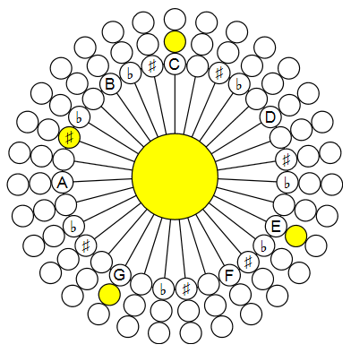
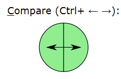
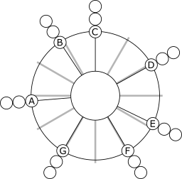
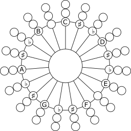
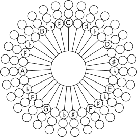
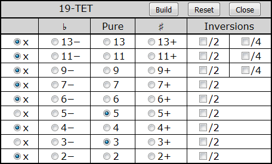
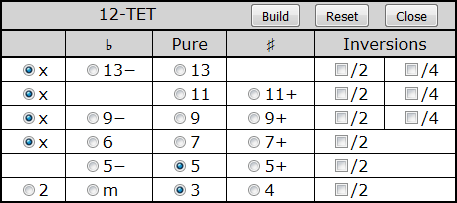
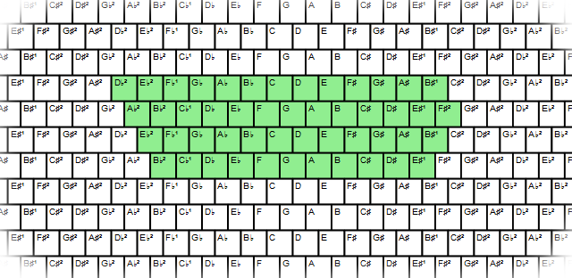

@numbering {
    enable: false
}

{title}Sound Builder, Web Audio Synthesizer

[*Sergey A Kryukov*](https://www.SAKryukov.org)

A pure Web browser application as a tool for advanced music harmony study in different tone systems 

<!-- <h2>Contents</h2> is not Markdown element, just to avoid adding it to TOC -->
<!-- change style in next line <ul> to <ul style="list-style-type: none"> -->
<!--
For CodeProject, makes sure there are no HTML comments in the area to past!


266D ♭music flat sign
266E ♮ music natural sign
266F ♯ music sharp sign
¹²
C &mdash; D♭² &mdash; Db &mdash; C♯ &mdash; C♯² &mdash; D 

--> 

---

<!-- copy to CodeProject from here ------------------------------------------->

<p id="image.title">



</p>

## Contents{no-toc}

@toc

## Introduction

This is the second article  in the series dedicated to musical study using specialized keyboards based on the computer keyboard:

1. *[Musical Study with Isomorphic Computer Keyboard](https://www.codeproject.com/Articles/1201737/Musical-Study-with-Isomorphic-Computer-Keyboard)*
2. Present article
3. *[Sound Builder, Web Audio Synthesizer](https://www.codeproject.com/Articles/5268512/Sound-Builder)*
 
 In my [first article](https://www.codeproject.com/Articles/1201737/Musical-Study-with-Isomorphic-Computer-Keyboard) of this series, I tried to explain very basic mathematical and physical aspects of music and put forward a keyboard structured to be very suggestive of music harmony. However, the application illustrates everything based on a much less general case of the [common-practice](https://en.wikipedia.org/wiki/Common_practice_period) [tone system](https://en.wikipedia.org/wiki/Musical_tuning).

The present and next article introduce the browser-based platform for microtonal music study, composers' experiments and more, called [Microtonal Fabric](https://github.com/SAKryukov/microtonal-fabric).

The present article describes two Microtonal Fabric applications. The first one corresponds to the topic described by the title of the article, it is called Multi-EDO; its source code can be found in "code/Multi-EDO".

The microtonal keyboard I've proposed provides more flexible ways for the very basic study of the field. I will often refer to certain points in my previous article. In the present article, I'm not going to get into theoretical reasoning much, mostly because my own study of microtonal music is only starting.

The second application is the auxilarry one used for the study and the comparison of different tonal systems, the source code can be found in "code/tone-system-comparison". It is useful for understanding of how different EDO systems work. In particular, it can be used to play and listen to the chords to detect the compromized harmonic quality of the traditional *common practice* [12-EDO system](https://en.xen.wiki/w/12edo) (Equal Division of Octave using 12 tones).

See also [my page](https://en.xen.wiki/w/Sergey_A_Kryukov) at the microtonal community Web site [Xenharmonic Wiki](https://en.xen.wiki). In addition to the Microtonal Fabric links, there are some useful links on different microtonal topics and personalities.

## Live Play

The ready-to-play applications, presently available in Microtonal Fabric can be found on the [Microtonal Fabric main documentation page](https://sakryukov.github.io/microtonal-fabric). One can try out the applications and play music directly in a Web browser.

The application discussed in the present article is named Multi-EDO and can also be played [here](https://sakryukov.github.io/microtonal-fabric/code/Multi-EDO).

If the touch screen is available, one can play musical instruments using ten fingers. This way chords can be played, even in combination with *glissando*.

Another application discussed in this article is the application for [microtonal system comparison](https://sakryukov.github.io/microtonal-fabric/code/tone-system-comparison).

## Why Microtonal?

There can be very [many answers](https://en.xen.wiki) to this question. Not trying to cover the topic, I'll try to point out, maybe in a naive and rough way, four aspects I consider the most fundamental:

1. Traditional Western [equal-temperament](https://en.wikipedia.org/wiki/Equal_temperament) faces serious problems. Strictly speaking, its harmony does not sound quite harmonically. Basic sense of harmony is based on fundamental physical and mathematical principles independent from particular culture. At the same time, [transpositional equivalence](https://en.wikipedia.org/wiki/Transposition_%28music%29#Transpositional_equivalence) is impossible to achieve with strict harmonics -- in my previous article, [I tried to explain it](https://www.codeproject.com/Articles/1201737/Musical-Study-with-Isomorphic-Computer-Keyboard#heading.rational-and-irrational-numbers). However hearing the defects require pretty well-trained ear. So, here is the first principle: with microtonal systems, it's possible to play music, which sounds very traditional, but more with improved harmony. At the same time, it's possible to play something very different from and unusual. 

1. The historical musical instrument tuning and tonal systems can be considered as microtonal in the following sense: they cannot be rendered using modern common practice approach and 12-tonal tonal system, 12-EDO. However, they cannot be approximated very well using microtonal systems. Those historical systems are usually more refined in terms of musical harmony. The problem of these systems is fixed tonality if a music piece, the lack of *transpositional equivalence*, so the arbitrary [*transposition*](https://en.wikipedia.org/wiki/Transposition_(music)) is impossible.
The rendering of historical tonal systems can be considered as actual, in particular, for so called [*historically informed performance*](https://en.wikipedia.org/wiki/Historically_informed_performance).

1. In non-Western cultures, microtonal approach is more actual. Traditional tuning systems can have more tones than twelve, they can use different principles rather than EDO. Microtonal Fabric helps to render any of those systems. For example, the application Microtonal Playground ("code/playground") contains the implementation of Indian [sruti](https://en.wikipedia.org/wiki/Shruti_(music)), traditional Chinese, and other systems. Microtonal Playground deserves a separate article.

1. How about the possibility to create really new music? From the first glance, it may sound impossible. I often heard from people, including musicians, that such music is awfully "out of tune". Is it, really? I think, it depends. It can sound totally [xenharmonic](https://en.wikipedia.org/wiki/Xenharmonic_music), but it really depends on the listener. The ability to perceive microtonal music can be limited by too strong bonding with current cultural environment. The musical sense is a complicated combination of fundamental laws of nature and culture — I also [tried to explain it](https://www.codeproject.com/Articles/1201737/Musical-Study-with-Isomorphic-Computer-Keyboard#heading.culture-versus-physics), very roughly. It simply means that understanding of anything which can be called "music" always required involvement in culture and considerable listening experience. Microtonal music just needs involvement in wider cultural context and more experience.

## Supported Tone Systems

The applicatin Multi-EDO supports the following systems:

- [Just Intonation](https://en.wikipedia.org/wiki/Just_intonation) (only [presented](https://sakryukov.github.io/microtonal-chromatic-lattice-keyboard/tone-system-comparison/tone-system-comparison.html) on the [chromatic-circle](https://en.wikipedia.org/wiki/Chromatic_circle) keyboard)
- [Common-practice](https://en.wikipedia.org/wiki/Common_practice_period) [12-TET](https://en.wikipedia.org/wiki/Equal_temperament)
- [19-TET](https://en.wikipedia.org/wiki/19_equal_temperament)
- 19-TET (since v.&thinsp;4.0)
- [31-TET](https://en.wikipedia.org/wiki/31_equal_temperament).

29-TET is supported by a separate application ("code/29-EDO"). This application is more advanced, is currently used for teaching music in the famouse international Brainin school of music on a regular basis. It deserves a separate article.

Any arbitrary tonal systems can be created using Microtonal Playground ("code/playground"),

## Features
- For three chromatic tone systems, the same keyboard is used; the choice of tone system can be changed dynamically
- Due to the very special keyboard layout, basic playing skills acquired and techniques learned for one tone system are immediately applicable to other tone systems
- Side-by-side comparison of the sound of tones and chords in different tone systems
- Choice of 5 instruments or 4 basic waveforms
- Chord generation
- Optional chord visualization
- Compatible browsers include, but not limited to Google Chrome, Mozilla Firefox, Mozilla SeaMonkey and Opera.

Since v.&thinsp;4.0:
- Touch screen support
- Key press dynamics

## Using the Application

The application could be considered as two independent [single-page applications](https://en.wikipedia.org/wiki/Single-page_application), not counting [index file](https://sakryukov.github.io/microtonal-chromatic-lattice-keyboard) simply referencing the matter involved. Implementations share some of JavaScript files, that's it.
???

1. First part: [Microtonal Tone Systems Comparison](https://sakryukov.github.io/microtonal-chromatic-lattice-keyboard/tone-system-comparison/tone-system-comparison.html) based on four chromatic-circle keyboards. Chords can be defined directly on the chromatic-circle keyboard and played separately on in fast succession comparison.
2. Second part: [Microtonal Chromatic Lattice](https://sakryukov.github.io/microtonal-chromatic-lattice-keyboard/keyboard/keyboard.html) keyboard, which allows playing wide range of tones. Chords can be defined through chord tables, auto-generated and played with single click or key press. 

The full source code can be downloaded, but there is no a need to download software to use it — everything can be played directly on the application [Web site](https://sakryukov.github.io/microtonal-chromatic-lattice-keyboard).

### Microtonal Tone Systems Comparison

On [this page](https://sakryukov.github.io/microtonal-chromatic-lattice-keyboard/tone-system-comparison/tone-system-comparison.html), all round shapes can be used as musical instrument keys. Lower octaves are closer to the center.
Central areas are used to play chords. The round shapes at the center are hidden and are visualized when at least one note is added to a chord. Shift+note toggles a note of a chord (double click to clears the chord). For example, the [picture on the top](#image.title) shows an inversion of the harmonic seventh chord, at the moment of playing, in [31-TET](https://en.wikipedia.org/wiki/31_equal_temperament) system. 

The chords can be played by clicking at the center round areas. Besides, if more than two chords are selected, two different temperaments can be listened in fast alteration on the special control "<u>C</u>ompare (Ctrl+ &larr; &rarr;)". When sound is activated, moving a mouse pointer between two halves quickly alters the chords:



Now, let's consider the circular keyboards to be used for study of different tone systems.

[Just Intonation](https://en.wikipedia.org/wiki/Just_intonation):


Just intonation is shown in comparison with the positions of [Common-practice](https://en.wikipedia.org/wiki/Common_practice_period) [12-TET](https://en.wikipedia.org/wiki/Equal_temperament) *semitones* depicted as gray radial lines. This picture reveals the bigger problem of tuning accuracy of 12-TET: pure rendering of 6th and, even more importantly, 3rd, which is the central note of very important [major chord](https://en.wikipedia.org/wiki/Major_chord). The errors are 15.6 [cents](https://en.wikipedia.org/wiki/Cent_%28music%29) for 6th and 13.7 for 3rd. Most probably people can hear the pretty subtle difference, perhaps after certain training, but the difference becomes more apparent in cases where inter-string resonances of the instruments (like piano or guitar) are noticeable.

I want to remind that [Just Intonation](https://en.wikipedia.org/wiki/Just_intonation) is based on pure [harmonic relationships]((https://www.codeproject.com/Articles/1201737/Musical-Study-with-Isomorphic-Computer-Keyboard#heading.rational-and-irrational-numbers)) between tones, is very important for comparison of tone systems, but is fairly impractical for playing of most musical pieces due to the lack of [transpositional equivalence](https://en.wikipedia.org/wiki/Transposition_%28music%29#Transpositional_equivalence).

[12-TET](https://en.wikipedia.org/wiki/Equal_temperament):


[19-TET](https://en.wikipedia.org/wiki/19_equal_temperament):


With [19-TET](https://en.wikipedia.org/wiki/19_equal_temperament), two different intervals between the degrees of [major scale](https://en.wikipedia.org/wiki/Major_scale): 2 (for B-C and E-F intervals) or 3 microtones. So, there is only one kind of sharp and one kind of flat, &plusmn;1 microtone. However, I avoid using ♯ and ♭ inside minor second intervals, to avoid the choice between [enharmonically equivalent](https://en.wikipedia.org/wiki/Enharmonic) notations, because, in microtonal systems, enharmonic equivalence generally cannot be assumed -- it is not the case for the 3-microtone minor second intervals.

[31-TET](https://en.wikipedia.org/wiki/31_equal_temperament):


With [31-TET](https://en.wikipedia.org/wiki/31_equal_temperament), there are two sharp and flat intervals, 2 and 4 microtones. "Inverted" order of ♯ and ♭ is not a mistake, because they are sharp and flat based on different notes. For example, all the tones in C to D and B to C intervals are:

C &mdash; D♭² &mdash; Db &mdash; C♯ &mdash; C♯² &mdash; D
B &mdash; C♭ &mdash; B♯ &mdash; C

Here, I denoted "double flat" (also known as half-sharp if counted from C) as D♭² and (also known as half-flat if counted from D) C♯². The Unicode characters for half/double sharp/flat are not standardized (and many other characters for musical notation are not implemented be default on most systems), so I decided to use my own notation, which is not shown on small keys.

This way, there is only one kind of ♯ and one kind of ♭: &plusmn;2 microtones.

So, there are two different intervals between the degrees of [major scale](https://en.wikipedia.org/wiki/Major_scale): either 5 or 3 (between B and C and between E and F) microtones. It makes 31 microtones and very good rendering of [major scale](https://en.wikipedia.org/wiki/Major_scale). At the same time altered intervals and chord can sound very differently.  

<p id="special.chord-tables">
Another way to define a chord is based on the degrees of the scale, chosen from a table.
</p>

This is the example of the table for [19-TET](https://en.wikipedia.org/wiki/19_equal_temperament) showing the default selection of [major chord](https://en.wikipedia.org/wiki/Major_chord):



For [31-TET](https://en.wikipedia.org/wiki/31_equal_temperament), the table is wider, because two more columns are added: "Double ♯" and "Double ♭".

For [Just Intonation](https://en.wikipedia.org/wiki/Just_intonation) and [12-TET](https://en.wikipedia.org/wiki/Equal_temperament), I imposed some constraints to keep the chords matching the definition for "valid" chord accepted as modern music term. For example, for [12-TET](https://en.wikipedia.org/wiki/Equal_temperament) there major/minor/diminished/augmented triad is always either present or replaced with sus2 or sus4 — look at the last line:



This is not the case for microtonal systems. For consistency, generalization and simplification, any subset of notes can be chosen, even the empty set, but no more than one alteration per zone. Note that 6th and 7th zones are not united for microtonal systems, because generally there is no [enharmonically equivalent](https://en.wikipedia.org/wiki/Enharmonic) between 6th and 7&minus;; by the same reasons, there are no empty table cells for altered notes.

The chord [inversions](https://en.wikipedia.org/wiki/Inversion_(music)) are created by the check boxes "/2" and "/4", which lower notes by one or two octaves. 

The same system of chord selection, based on shared JavaScript code, is used for "big" chromatic lattice keyboard. Such selection provides the only way to play a chord in one click.

### Microtonal Chromatic Lattice

Basically, the idea of the keyboard structure is based on [Wicki-Hayden layout](https://en.wikipedia.org/wiki/Wicki-Hayden_note_layout), but the geometry is different. Instead of being hexagonal, it is rectangular, which is simpler and better matches the symmetry of the grid of tone relationships.

The keyboard takes the same share, dimensions and structure as the one offered in the [previous article](https://www.codeproject.com/Articles/1201737/Musical-Study-with-Isomorphic-Computer-Keyboard). Its *fragment* is shown for [31-TET](https://en.wikipedia.org/wiki/31_equal_temperament):



The green area is used to play part of the tones using the physical computer keyboard (sorry, modeled based on standard US keyboard layout, without any options; anyone who really needs something else is welcome to address me).

The controls are different. First of all, one of the three tone systems and four layouts ([12-TET](https://en.wikipedia.org/wiki/Equal_temperament), 12-TET in [Jankó layout](https://en.wikipedia.org/wiki/Jank%C3%B3_keyboard), [19-TET](https://en.wikipedia.org/wiki/19_equal_temperament) and [31-TET](https://en.wikipedia.org/wiki/31_equal_temperament)) can be chosen at any time.

Other controls enable optional highlighting of chords (played prefixed with Ctrl+) and chosen from the tables [described above](#special.chord-tables) and chord note marking using the scale degree notation.

First surprising thing is that the tone layout looks nearly identical to that of 12-TET. This layout is very special: 1) it is very suggestive of harmonic relationship between notes; 2) the layouts for different tone systems are "locally identical". The differences become apparent, for example, in the attempt to perform [harmonic modulation](https://en.wikipedia.org/wiki/Modulation_%28music%29), which is very easy though, due to chromatic nature of the keyboard. How it works?

Here is how the layout is structured:


The intervals in semitones depend on the tone system:

<table class="grid">
<tr>
<td>12-TET</td><td>K=2</td><td>L=5</td><td>M=7</td>
</tr>
<tr>
<td>19-TET</td><td>K=3</td><td>L=8</td><td>M=11</td>
</tr>
<tr>
<td>31-TET</td><td>K=5</td><td>L=13</td><td>M=18</td>
<tr>
</table>

Obviously, the ratio values 3/2, 4/3 and 9/8 are only approximated by microtonal intervals, because rational frequency ratio values are [impossible with equal temperaments](https://www.codeproject.com/Articles/1201737/Musical-Study-with-Isomorphic-Computer-Keyboard#heading.rational-and-irrational-numbers).

## Implementation

### Sound Synthesis

Firstly, sound synthesis is totally based on [Web Audio API](https://developer.mozilla.org/en-US/docs/Web/API/Web_Audio_API) implemented by nearly all major browsers. Presently, it is based on the [W3C working draft of August 2017](https://webaudio.github.io/web-audio-api).

Since v.&thinsp;5.0, the synthesis is fully based on the code of Sound Builder and the instrument data it generates. Please see the [article on Sound Builder](https://www.codeproject.com/Articles/5268512/Sound-Builder) for further detail.

### Sound Quality

Because of the problems explained above, I would consider the quality as basically acceptable, but far from decent. First of all, I just failed to find sufficient number of good samples. I would gladly try to use any data or advice. Perhaps sample-free synthesis of sounds from scratch Perhaps sample-free synthesis of sounds from scratch based on [Web Audio API](https://developer.mozilla.org/en-US/docs/Web/API/Web_Audio_API) would be more suitable.

### Scalable Vector Graphics

In early versions of the software, I've used not a very usual method of HTML/CSS/JavaScript development: embedded [SVG](https://en.wikipedia.org/wiki/Scalable_Vector_Graphics). Here is the idea: the UI element is developed using wonderful SVG-based vector editor, [https://en.wikipedia.org/wiki/Inkscape](https://en.wikipedia.org/wiki/Inkscape); any other suitable editor can be used. In JavaScript code, some of the SVG elements are found using their `id` values or known inner XML structure. When this is done, obtained JavaScript objects can be modified by altering their attributes (first of all, CSS attributes). And then, input event properties can be added to these elements. This is how a musical instrument key function can be implemented, such as production of sound and highlight.

Later, I got rid of this bulky method. SVG is to big to manage in this case, but this method could be very convenient for some other applications. If someone needs some more explanations, please ask me questions.

Presently, SVG element is populated automatically based on calculations. SA???

For the detail, please see complete source code.

### Multi-touch Support

One of the most important features of Microtonal Fabric is its support for multi-touch devices, such as a touchpad or touchscreen.

SA???

```{lang=JavaScript}{id=code.multi-touch}
"use strict";

const setMultiTouch = (
    container,
    elementSelector, // element =&gt; bool
    elementHandler,  // (element, Touch touchObject, bool on) =&gt; undefined
    sameElementHandler, // (element, Touch touchObject) =&gt; undefined: handles move in idthe area of the same element
) =&gt; {

    if (!container) container = document;

    const assignEvent = (element, name, handler) =&gt; {
        element.addEventListener(name, handler, { passive: false, capture: true });
    };
    const assignTouchStart = (element, handler) =&gt; {
        assignEvent(element, "touchstart", handler);
    };
    const assignTouchMove = (element, handler) =&gt; {
        assignEvent(element, "touchmove", handler);
    };
    const assignTouchEnd = (element, handler) =&gt; {
        assignEvent(element, "touchend", handler);
    };

    if (!elementSelector)
        return {
            assignTouchStart: assignTouchStart,
            assignTouchMove: assignTouchMove,
            dynamicAlgorithm: (touch, volumeDivider) =&gt; { return Math.pow(touch.radiusX * touch.radiusY, 2) / volumeDivider; }};

    const isGoodElement = element =&gt; element && elementSelector(element); 
    const elementDictionary = {};
    
    const addRemoveElement = (touch, element, doAdd) =&gt; {
        if (isGoodElement(element) && elementHandler)
            elementHandler(element, touch, doAdd);
        if (doAdd)
            elementDictionary[touch.identifier] = element;
        else
            delete elementDictionary[touch.identifier];
    }; //addRemoveElement

    assignTouchStart(container, ev =&gt; {
        ev.preventDefault();
        if (ev.changedTouches.length &lt; 1) return;
        const touch = ev.changedTouches[ev.changedTouches.length - 1];
        const element = document.elementFromPoint(touch.clientX, touch.clientY);
        addRemoveElement(touch, element, true);    
    }); //assignTouchStart
    
    assignTouchMove(container, ev =&gt; {
        ev.preventDefault();
        for (let touch of ev.touches) {
            let element = document.elementFromPoint(touch.clientX, touch.clientY);
            const goodElement = isGoodElement(element); 
            const touchElement = elementDictionary[touch.identifier];
            if (goodElement && touchElement) {
                if (element == touchElement) {
                    if (sameElementHandler)
                        sameElementHandler(element, touch)
                        continue;
                    } //if same
                addRemoveElement(touch, touchElement, false);            
                addRemoveElement(touch, element, true);
            } else {
                if (goodElement)
                    addRemoveElement(touch, element, goodElement);
                else
                    addRemoveElement(touch, touchElement, goodElement);
            } //if    
        } //loop
    }); //assignTouchMove
    
    assignTouchEnd(container, ev =&gt; {
        ev.preventDefault();
        for (let touch of ev.changedTouches) {
            const element = document.elementFromPoint(touch.clientX, touch.clientY);
            addRemoveElement(touch, element, false);
        } //loop
    }); //assignTouchEnd

};
```

### Compatibility

At the moment of writing, Web Audio API exists as a W3C editor's [draft of September 2017](https://webaudio.github.io/web-audio-api). Nevertheless, the applications described in the present article work with most major browsers.

Another advanced aspect is the use of SVG embedded in HTML. This feature is presently the part of [W3C Recommendation of October 28, 2014](https://www.w3.org/TR/html5/embedded-content-0.html#svg) and also should be quite usable.

Besides, more modern JavaScript syntax is used, including `const`, `let` and `for... of`, not supported by some old browsers.

The applications are successfully tested on Google Chrome, Opera, Mozilla Firefox and Seamonkey.

Not too surprisingly, nothing works on Microsoft browsers, and by some reasons, not even Edge (despite Mozilla documentation claiming that both Audio API and embedded SVG are supported by Microsoft Edge). As these products often demonstrated lack of compliance throughout their history and improvements have been very limited, it seems to be practical to curb their operation with advanced applications and provide some information on their incompatibility. However, this brings us to the problem solved in not very trivial way.

The problems start at the attempt to detect the browser or some separate feature and present some information on incompatible browser. Generally, if we have this code followed by some code unsupported by some browsers, it is impossible, because the whole thing, including detection code, may not execute at all. Why? Because JavaScript is not a pure interpreter. After loading, the script is "pre-compiled" on some lexical level. If this step fails, whole script fails, without execution of supportable part of code. This failure cannot be bypassed by putting the incompatible code in a `try` block.

It looks like the only feasible general-purpose resolution of this problem is dynamic loading of scripts. The HTML file can include only one script via the use of the `script` element. This script can detect the browser, perform appropriate processing depending on the detection result and then load other scripts. The names of the scripts to be loaded need to be passed to the first script.

This is how it works:

```{lang=JavaScript}{id=code.good-browser}
"use strict";

function handleGoodBrowser(scripts, successAction, errorAction) {

    // no "const", "let", lambda-like syntax () =&gt; {}, not "for... of Object",
    // no String.prototype.includes -- it won't work with some bad browsers    

    var saveWindowErrorHandler = window.onerror;
    var saveBodyLoadHandler = document.body.onload;
    var hasError = false;
    window.onerror = function (event) {
        hasError = true;
    };
    var currentOrder = 0;
    function loadScript() {
        if (currentOrder == scripts.length)
            return;
        var scriptElement = document.createElement("script");
        scriptElement.src = scripts[currentOrder];
        scriptElement.onload = function () {
            currentOrder++;
            loadScript();
        }; //scriptElement.onload
        scriptElement.onerror = function () {
            throw new URIError("error");
        }; //scriptElement.onerror
        document.body.appendChild(scriptElement);
    }; //loadScript
    loadScript();
    window.onerror = window.onerror;
    document.body.onload = function () {
        if (hasError && errorAction)
            errorAction();
        else if (!hasError && successAction)
            successAction();
        document.body.onload = saveBodyLoadHandler;
    }; //if hasError

} //handleGoodBrowser
```

The function `handleGoodBrowser` accepts array of script names relative to the name of the HTML file. So, instead of loading all the scripts using the `script` element, the developer needs to add only the script with `handleGoodBrowser` and pass the file names of other script in the actual argument of the call.

The other scripts, all the scripts other than the one shown above, are loaded recursively via `loadScript` by one important reason: generally, scripts depend on each other, so the order of their execution is essential. This function guarantees that the scripts are loaded one by one, because each load entails adding next script in the array in DOM.

## Versions

#### 1.0.0
Initial production version.

#### 1.1.0
* Added option "Use Computer Keyboard".
* On application pages, added links to original publication.

The option added is important because some key combinations such as Ctrl+W (usually, browser's close tab) are busy with the physical computer keyboard function.

#### 2.0.0
* Added browser detection and dynamic [script loading](#heading.compatibility).

Now the compatible browser is detected as the one which successfully loads all scripts. No criteria related to user agent product names, manufacturers or versions are used.

#### 2.1.0
* Developed detection of incompatible browsers.

#### 4.0.0
* Touch screen support.

#### 4.1.0
* Keyboard layout is generated dynamically rather then imported from vector graphics image; it helped to make keyboard layout variable.
* Markup of the hardware keyboard on a on-screen keyboard (shown in green) is automatically calculated based on on-screen keyboard.
* Several minor improvements.

#### 4.2.0
* Major re-factoring performed to improve modularity and untangle dependencies between modules.
* Unification of keyboard.html and tone-system-comparison.html applications, improved code, reduced unwanted dependencies between applications.
* Developed conversion of objects to read-only, recursive or not, applied to definition sets of applications.
* Solved the problem of silent first note in file-based instruments, due to the use of futures and a need for defer. (SA???)
* Fixed and improved the mechanism of detection of incompatible browsers, discriminated Microsoft Edge by its features.

#### 5.0
Sound generation is migrated to the use of [Sound Builder](https://www.codeproject.com/Articles/5268512/Sound-Builder).

#### 5.4
* Wave FFT (see [Sound Builder](https://www.codeproject.com/Articles/5268512/Sound-Builder)) is migrated to .NET from .NET Core.
* Refactoring related to the newly created project name, "Microtonal Framework".

<!-- copy to CodeProject to here --------------------------------------------->
