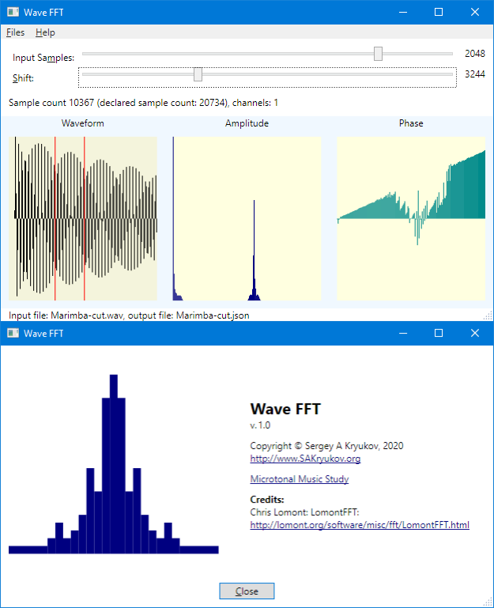

@numbering {
    enable: false
}

{title}Sound Builder, Web Audio Synthesizer

[*Sergey A Kryukov*](https://www.SAKryukov.org){.author}

*In-browser synthesizer creates instruments to be used in musical applications, offers advanced additive and subtractive synthesis techniques*

<!-- <h2>Contents</h2> is not Markdown element, just to avoid adding it to TOC -->
<!-- change style in next line <ul> to <ul style="list-style-type: none"> -->
<!--
For CodeProject, makes sure there are no HTML comments in the area to past!

See: https://www.codeproject.com/script/Articles/ArticleVersion.aspx?waid=277187&aid=1278552&PageFlow=FixedWidth
Original publication:
https://www.codeproject.com/Articles/5268512/Sound-Builder

Abstract:

This in-browser synthesizer creates instruments to be used in musical applications, offers advanced additive and subtractive synthesis techniques. It is based on Web Audio API and relies only on the browser, does not require any server-side part. It creates the synthesizers of the musical instruments. The synthesizers can be exported and embedded in a Web application.

<!-- copy to CodeProject from here ------------------------------------------->

{id=picture-main}

<blockquote id="epigraph" class="FQ"><div class="FQA">Epigraph:</div>

<p><i>If something is prohibited but you badly want it, it is&hellip; permitted</i></p>
<dd>Folk wisdom</dd></blockquote>

## Contents{no-toc}

@toc

## Introduction

This is the third article of the series dedicated to musical study with on-screen keyboards, including microtonal ones:

- [Musical Study with Isomorphic Computer Keyboard](https://www.codeproject.com/Articles/1201737/Musical-Study-with-Isomorphic-Computer-Keyboard)
- [Microtonal Music Study with Chromatic Lattice Keyboard](https://www.codeproject.com/Articles/1204180/Microtonal-Music-Study-Chromatic-Lattice-Keyboard)
- Present article

The present and the previous article describe different applications of a single project [Microtonal Fabric](https://github.com/SAKryukov/microtonal-fabric). The present article describes the sound synthesis engine used by all Microtonal Fabric applications. The Sound Bilder application provides a method used to synthesize the sounds of different musical instruments and to create a library of sounds.

See also [my page](https://en.xen.wiki/w/Sergey_A_Kryukov) at the microtonal community Web site [Xenharmonic Wiki](https://en.xen.wiki). In addition to the Microtonal Fabric links, there are some useful links on different microtonal topics and personalities.

## Motivation

The main driving force of this present work is a severe need.

Two articles related to this topic are published as [Musical Study with Isomorphic Computer Keyboard](https://www.codeproject.com/Articles/1201737/Musical-Study-with-Isomorphic-Computer-Keyboard) and [Microtonal Music Study with Chromatic Lattice Keyboard](https://www.codeproject.com/Articles/1204180/Microtonal-Music-Study-Chromatic-Lattice-Keyboard). Even though the first article has nothing to do with microtonal systems, it describes some basic theoretical explanations of the topic.

The second keyboard is _microchromatic_, very innovative, and works in a Web browser with the use of [Web Audio API](https://developer.mozilla.org/en-US/docs/Web/API/Web_Audio_API). Recently, it used my heavily modified fork a third-party open-source library with very serious defects which I'm not going to discuss here. Anyway, it already played its role when the proof of concept goal was more important. These days, I continue the research and development and cannot tolerate those defects and insufficient maintainability. Later, I decided to develop my own sound synthesis engine and a tool. In other words, I started the work just because I [badly wanted](#epigraph) to get the result. I introduced my results to some prominent musicians, specialists in microtonal music, theorists and educators, and got very positive feedback. I think the tool is advanced, accurate, and interesting enough to share it.

## Advanced features

The tool is a synthesizer synthesizer, or a generator of the instrument instances which can be [exported](#api-export) in a form of a single JSON file, [embedded](#api-embed) in some other JavaScript code, and [used](#api-use) for the implementation of an in-browser musical instrument based on Web Audio API, or some other tool for the generation of music on a Web page. The tool is oriented to both common-practice and [microtonal](https://en.wikipedia.org/wiki/Microtonal_music) or [xenharmonic](https://en.xen.wiki) musical applications.

No part of the code uses any server-site operation, so any part of the code can be played locally on a wide range of devices, even without a connection to the Internet.

Some features of the tool are somewhat innovative. Overall, it helps to generate near-realistic instrument sound, defining advanced effects in a graphical manner using a convenient UI. The user is not required to be able to work with audio nodes, draw any graphics, or understand Web Audio API. Instead, the procedure of the design of an instrument is based on filling data in several tables, possibly some trial-and-error approach with listening to intermediate results of the synthesis.

The procedure of instrument authoring is started with a single oscillator defined by a Fourier spectrum. Such a spectrum can be imported from a spectral analyzer of an available code sample, but an additional edition is usually required. Alternatively, traditional signal waveforms, such as sawtooth or triangle, are also available, but more realistic sounds require the Fourier-based approach.

On top of this, the user can define an unlimited number of modulators. A modulator can be used for frequency or amplitude modulation, and each of them can be either an absolute-frequency or a relative-frequency modulator. For absolute modulations, the user can define a fixed frequency for each one, but for relative-frequency modulations, the frequency of the modulation signal depends on the fundamental frequency of each tone.

On top of this, the result of synthesis can be shaped using an envelope. Unlike conventional synthesis systems, in addition to a usual volume enveloped, there are three additional kinds of envelope: one for temporary detune, and two for modulations, separately for frequency and amplitude modulation.

On top of this, there is a set of filters with user-defined parameters. Any subset of filters can be included in use or excluded.

Finally, on top of this, there is a gain compensation system.

During the work, the author of an instrument uses a set of interactive tools used to listen to intermediate results. There is a test Jankó-style keyboard, corresponding to the standard 88-key piano without one highest tone. The keyboard can be played with a mouse or by all 10 fingers using a touch screen. For both methods of playing, glissando is also possible, which is the somewhat not very trivial technical aspect. Another important feature is this: during trial playing, any of the classes of the effects can be temporarily turned on, which is important for comparisons. Also, trial playing can be done with the control of volume, (additional) sustain, and transposition. These controls are not parts of the resulting instruments and are designed specifically for trial playing.

## A Word of Warning and a Disclaimer

Synthesis is such a thing... If you use this tool, please make sure you proceed carefully to protect your musical hearing from considerable shock. In some cases, accidental mistakes in parameters can produce awful almost traumatizing sound. I can see no chance to filter out bad things automatically, besides, it would be unfair.

I cannot assume any responsibility for the production of bad or unpleasant sounds; this is the sole responsibility of the user. I only can assure the production of reasonably nice sounds is quite possible. Anyway, I provide a library of some instrument samples.

## Audio Graph

First of all, the most important design feature is this: all keys of the on-screen keyboard should be able to generate sound at the same time. One may ask: why would we need all of them? --- if we play with only 10 fingers? Simple: this is because of the *sustain* value of an instrument. For example, if we press a sustain pedal of a piano and keep it down, we can, in principle, quickly hit all 88 strings, so at some moment all of them can generate sound, no matter how insane it may sound.

To achieve that, we have to dedicate a considerable number of nodes to each instrument key. These parts of the graph are implemented by an object of a type `Tone`. However, we also minimize the number of those per-key nodes. It can be done by sharing some of our audio effects in another object of the type `Instrument`.

First, let's see what we can share. The set of filters can be shared. Some modulations can be shared, but some should be per key. I developed four kinds of modulation. We can apply an unlimited number of frequency modulators (FM) and amplitude modulators (AM). Each of those modulators can be either absolute frequency or relative frequency. All absolute-frequency modulators can be placed in the single-instance `Instrument` and `Tone` instances can share them. But relative-frequency modulators modulate at some frequencies which are different for each of the tones. In the tool, the actual frequency is the fundamental frequency of each tone, simply multiplied by some factor, with fixed modulation depths, individual for each modulator.

Therefore, both `Instrument` and `Tone` are based on the same type named `ModulatorSet`. For the implementation of a set of modulators, it does not matter which role it plays, absolute frequency or relative frequency, implementation is the same.

Another per-tone part of the graph is a set of gain nodes used as targets for _envelopes_. An envelope is a mechanism used to program the dynamic behavior of a tone in its attack and damping. Customary synthesis technology usually implements only the envelope controlling volume, with a fixed number of stages. The usual envelope is called [ADSR](https://en.wikipedia.org/wiki/Envelope_(music)) (Attack, Decay, Sustain, and Release), but I don't even want to discuss it here, because it cannot satisfy me. Sound Builder has a unified system of authoring envelopes of several types which makes it possible to create an envelope with an unlimited number of stages. Each stage is characterized by its time, gain, and choice of one of three functions. There are four characteristics of a node, and each of them can be envelope-programmed: volume, detune, AM, and FM.

Now, we are ready to present a graph, starting with the tone part of it. First, let's introduce some graphical conventions.

 Oscillator node

 Gain node

 Envelope, gain node with gain controlled by envelope functions

 Modulator set

 Chain of nodes

 Output node

The graph is shown schematically in two parts, left and right. On left, there is a singleton instance of `Instrument` connected with a set of `Tone` instances shown as only one on left. Let's remember that there is an entire set of `Tone` instances, all having different fundamental frequencies. Every `Tone` instance is connected to the instance of the instrument in three ways. An `Instrument` instance supplies two signals from the sets of FM and AM modulators, which are common to all tones, and receives a fully-shaped sound signal from each tone, modulated and controlled by the functions of the envelopes.

{id=picture-graph}

There are four kinds of oscillators. The first one provides a signal of a fundamental frequency for each tone. Two sets of oscillators in each tone graph supply FM and AM signals of frequencies depending on the fundamental frequency, and two more sets of oscillators supply FM and AM signals of fixed frequencies to all tone graphs.

At the very beginning of the operation, as soon as the entire graph is populated and connected, all oscillators start and provide their signals permanently, even when no sounds are emitted. The sound signals from the tone graphs are blocked by their gain envelopes. The oscillators stop only when the graph needs to be re-populated according to new instrument data.

Let's first consider the main kind of oscillator, the one supplying the base of the sound. Naturally, in absolutely all cases, it provides an entire spectrum of frequencies based on its fundamental frequency.

## Main Oscillator

This node is created by the Web Audio [constructor](https://developer.mozilla.org/en-US/docs/Web/API/OscillatorNode/OscillatorNode) `OscillatorNode`.

The user selects the spectrum of the node by assigning a value to the property `type`, this is either a string value, "sawtooth", "triangle", or custom. In the case of "custom", this string should not be assigned. Instead, the method [setPeriodicWave](https://developer.mozilla.org/en-US/docs/Web/API/OscillatorNode/setPeriodicWave) is called. In the Sound Builder UI, [it corresponds to the choice "Fourier"](#picture-main).

This call is a working horse of synthesis. The data for the wave is supplied by the instance of `Instrument` and is shared by all tones. This is because the components of the Fourier spectrum are relative to the fundamental frequency.

In the Sound Builder UI, the spectrum is represented not by an array or complex number, but by an equivalent array of amplitudes and phases, which the user can "draw" with a mouse on a table of sliders. Each slider is an input element with `type="range"` with modified behavior which allowed drawing-like mouse action.

### Wave FFT

An alternative way of entering data is using a separate application "WaveFFT.exe" (WAV file to Fast Fourier Transform). It can load a WAV file, observe its waveform, select a fragment of the sample sequence (FFT supports a number of samples equal to the natural power of 2, this is supported by the U), perform FFT, observe resulting spectrum and save this data in the format of Sound Builder instrument data file.

Typically, the data file created with WaveFFT serves as a starting point. Another way to start creating some instrument data is using sample files downloadable with this article.

This application could be a matter of a separate article. In brief, this is a .NET WPF application, so it can be executed on different platforms without the rebuild. The appropriate [framework](https://en.wikipedia.org/wiki/.NET) needs to be installed.

The build is set to .NET v.&thinsp;5.0. It should build and work for later .NET versions. To change the target .NET version, one would need to change only one line in "WaveFFT/Directory.Build.props".



## Oscillator Control

With Web Audio API, a node can be connected to another node or an object which is a property of a node, if this object supports the interface [AudioParam](https://developer.mozilla.org/en-US/docs/Web/API/AudioParam). This is a way to modulate the value corresponding to one or another audio parameter.{id=in-text-how-to-modulate}

[OscillatorNode](https://developer.mozilla.org/en-US/docs/Web/API/OscillatorNode/OscillatorNode) has two [a-rate](https://developer.mozilla.org/en-US/docs/Web/API/AudioParam#a-rate) properties, supporting the interface [AudioParam](https://developer.mozilla.org/en-US/docs/Web/API/AudioParam): [frequency](https://developer.mozilla.org/en-US/docs/Web/API/OscillatorNode/frequency) and [detune](https://developer.mozilla.org/en-US/docs/Web/API/OscillatorNode/detune).

Frequency [AudioParam](https://developer.mozilla.org/en-US/docs/Web/API/AudioParam) input can be used for FM, which, optionally, can be enveloped. The same can be done to detune, but modulation of the detune parameter would make little sense. Instead, it can be modified through an envelope.

## Modulation

Two kinds of modulation are implemented in different ways: FM signal connects to the frequency input of some oscillator, while AF needs to be done on output, to modulate the gain of a signal, which is already generated and frequency-modulated.

Therefore, the FM signal is connected to an oscillator node frequency [AudioParam](https://developer.mozilla.org/en-US/docs/Web/API/AudioParam), as explained [above](#in-text-how-to-modulate), and the AM signal is connected to some gain node.

In both cases, FM and AM signals are connected to some gain node, shown on the [graph](#picture-graph) as "FM Envelope" and "AM Envelope", correspondingly. 

Each of those gain modes receives FM and AM signals from two sources, absolute-frequency modulation signals from the `Instrument` instance and relative-frequency modulation signals from within the same `Tone` instance.

On top of that, let's remember that "FM Envelope" and "AM Envelope" gain nodes are also envelopes. It means that the gain value of these nodes is kept at zero until a performer press down a key. When it happens, an envelope function is applied to the gain, to open signals to output. Let's see how it works.

## Envelopes

The operation of envelopes relies on the functionality of [AudioParam](https://developer.mozilla.org/en-US/docs/Web/API/AudioParam). Each instance of `AudioParam` can be programmed to change the value automatically at a future time. When a performer presses a key on some instrument keyboard, the gain and some other audio parameters are programmed to implement some dynamics.

An envelope defines a function of time, controlling the value of an `AudioParam` instance. This is a piecewise-smooth function, composed of the function of 3 types: exponential, linear, and, with some degree of conventionality, less usable [Heaviside function](https://en.wikipedia.org/wiki/Heaviside_step_function). For each piece, the user adds a line to an envelope table and defines the duration of each step and a target value.

This is the core of the implementation of the envelope from "sound/envelope.js":
```{lang=JavaScript}{id=code-envelope}
for (let element of this.#implementation.data) {
    switch (element.type) {
        case this.#implementation.typeHeaviside:
            audioParameter.setValueAtTime(element.gain, currentTime + element.time);
            break;
        case this.#implementation.typeExponential:
            if (element.gain == 0 || element.isLast)
                audioParameter.setTargetAtTime(element.gain, currentTime,  element.time);
            else
                audioParameter.exponentialRampToValueAtTime(
                    element.gain,
                    currentTime + element.time);
            break;
        case this.#implementation.typeLinear:
            audioParameter.linearRampToValueAtTime(element.gain, currentTime + element.time);
            break;
    } //switch
    currentTime += element.time;
}
```

It's important to note, that the exponential function is implemented in two different ways: via [setTargetAtTime](https://developer.mozilla.org/en-US/docs/Web/API/AudioParam/setTargetAtTime) or [exponentialRampToValueAtTime](https://developer.mozilla.org/en-US/docs/Web/API/AudioParam/linearRampToValueAtTime). The first case is used when a target value is zero, and the stage is the very last one. It is done so, because, for obvious mathematical reasons, the target value cannot be zero for the exponent. Then the function represents the "infinite" approach of an `AudioParam` value to the target value. Naturally, for the last stage, such behavior represents the natural damping of an instrument sound or growing of the parameter to the values corresponding to the stabilized sound, zero or not. In both cases, "infinite" exponential behavior is the most suitable.

With Sound Builder, the envelopes can optionally be applied to three characteristics of a sound: volume, detune, FM, and AM.

Let's discuss the application of these techniques.

### Volume Envelope

This is the most traditional kind of envelope, which is used, for example, in ADSR. The difference is not only the unlimited number of stages. An additional volume envelope characteristic is its dumping sustain. There is no such thing as a sound stopping instantly. If we try to produce such instantaneous stop, electronics not instantaneously, but very quickly, which, naturally, produces so wide spectrum, that is perceived as a very unpleasant crackling noise. The same thing can happen if an attack is too fast. I don't think any timing faster than some 10 ms can be practically used, so the envelope stage times are limited by this maximum duration. Dumping sustain happens when we play, for example, a piano and release a key. But what happens when we keep a key down or use a *sustain* key?

In this case, the behavior is defined by the last stage of an envelope. We can define essentially two different types of instruments. The first type is suitable for an instrument with natural damping behavior, such as pianos or bells. For these instruments, the target value of the gain of the last stage should be zero, but the stage itself can be prolonged, say, up to several seconds. If we make this time about 10 milliseconds or perhaps a few times greater, we can achieve the effect closer to some melodic percussion. The second type can model the instrument of "infinite" sound, such as in wind or bowed string instruments. The target gain of the last envelope stage should be of maximum value, or about it. In this case, the sound is damped only when a performer releases a key.

### Detune Envelope

It is not unusual, that an instrument plays a tone, which is, during some limited time, detuned, especially during the attack phase. For example, it happens in loud fingerstyle guitar playing. At the first phase of plucking the string, it is considerably elongated and hence sounds sharper than the tone it is tuned to. Besides, at first, a string can be pressed against the fret with a greater force. This effect can be achieved by controlling some detune value of the oscillator. Naturally, unlike the case of the volume, the detune value of the last stage should be zero.

Detune envelope is the only envelope not represented on the [audio graph](#picture-graph) as an envelope-controlled gain mode. Its target is the [detune](https://developer.mozilla.org/en-US/docs/Web/API/OscillatorNode/detune) [AudioParam](https://developer.mozilla.org/en-US/docs/Web/API/AudioParam) of each main oscillator of a tone. No gain node is required for this functionality. The master gain of the effect is simply a numerical factor; all target values for all envelope stages are multiplied by this factor.

### Modulation Envelopes

The two remaining envelopes are those separately controlling AM and FM, but I don't make any distinction between absolute-frequency FM/AM and relative-frequency FM/AM. Instead, one envelope controls all AM and one --- all FM. Let's consider a typical case of such an envelope. A tuba or a saxophone, as well as many other wind instruments, show extremely strong vibration when a performer starts to blow a sound, but the vibration becomes barely perceivable as the sound stabilizes. This can be achieved with these two kinds of envelope.

## Filters

The subtractive part of the synthesis is represented by a set of biquadratic low-order filters. Some filtering is required in most cases.

Filter parameters are filled in in a table with the help of sliders. Each of the provided filter types can be included in the instrument graph, or it can be excluded. In most cases, only one low-pass filter is sufficient.

To learn filter tuning, a good starting point could be [BiquadFilterNode documentation](https://developer.mozilla.org/en-US/docs/Web/API/BiquadFilterNode).

## Gain Compensation

Both kinds of design features of the instrument synthesis, additive synthesis based on the Fourier spectrum, and subtractive synthesis based on filters, make the final volume of each tone hard to predict. The worst thing is: all tones produce very different subjective levels of volume, depending on the frequency. The overall volume of an instrument also can differ dramatically. Hence, some frequency-dependent gain compensation is badly needed. I've tried a good deal of research using different "clever" functions but finally ended up with the simplest approach: quadratic spline defined by three points: some low frequency and compensation level for this frequency, some high frequency, and compensation level for this frequency and some medium frequency point where the compensation is considered to be equal to 1. Naturally, two quadratic functions are stitched at this point. This simple function has the following benefit: one can compensate for part of the spectrum on the right of this point, then, separately, on the left part of the spectrum. When the left or right part is done, compensation for another part won't spoil previous work.

This procedure requires a table of three parameters: low-frequency and high-frequency compensation and the position of the middle frequency, plus the value for the overall compensation factor. Two values for low and high frequencies themselves are not presented in the table, because they rarely, if ever, need to be modified; they correspond to the highest or lowest frequencies of a standard 88-key piano. However, they are prescribed in the data files (where they are written based on the code's definition set) and can be modified by some overly smart users. :-)

This is the implementation of this simple spline function:

```{lang=JavaScript}{id=code-envelope}
const compensation = (() =&gt; {
    const compensation = (f) =&gt; {
        const shift = f - this.#implementation.gainCompensation.middleFrequency;
        const g0 = this.#implementation.gainCompensation.lowFrequencyCompensationGain;
        const g1 = this.#implementation.gainCompensation.highFrequencyCompensationGain;
        const f0 = this.#implementation.gainCompensation.lowFrequency;
        const f1 = this.#implementation.gainCompensation.lowFrequency;
        const factor0 = (g0 - 1) / Math.pow(
            f0 - this.#implementation.gainCompensation.middleFrequency, 2);
        const factor1 = (g1 - 1) /
            Math.pow(f1 - this.#implementation.gainCompensation.middleFrequency, 2);
        if (shift &lt; 0)
            return 1 + factor0 * Math.pow(shift, 2);
        else                
            return 1 + factor1 * Math.pow(shift, 2);
    } //compensation
    return compensation;
})(); //setupGain
```

The stitching happens at the medium frequency point, at the point of zero derivative, but with a step in second derivative. This imperfect _smoothness_ may sound questionable, but, after some experiments, seems to produce a smooth sound, pun unintended ;-).

The compensation function depends on the fundamental frequency of each of the main oscillators, the value of gain compensation is combined as a result of the operation of many gain nodes, gain nodes "Compensation", one per `Tone` instance, plus one node of the `Instrument` instance, "Gain compensation", as shown on the [graph](#picture-graph).

## Using API and Generated Instruments In Applications

Naturally, Sound Builder doesn't do much if it is not used in other applications. See the instructions at https://SAKryukov.github.io/microtonal-chromatic-lattice-keyboard/SoundBuilder/API.html.

Basically, the user needs to produce a set of desired instruments and test them.

- Produce some set of instruments, test and save them, each instrument is a separate JSON - file;
- Use the element “Instrument List”, button “Load” to load created instruments, “Save” all of them in a single .js file;{id=api-export}
- Include the API, all sound/*.js files in the application;
- Also, include .js file generated before;{id=api-embed}
- In the application, create an instance of `Instrument`;
- To apply instrument data, assign `instrumentInstance.data = instrumentList[someIndex]`;
- To play a single sound, call `instrumentInstance.play`;{id=api-use}
- Enjoy :-).

Now, let's see how the API looks in detail.

### API

The `Instrument` constructor expects 2 arguments: `constructor(frequencySet, tonalSystem)`.

First of all, one needs to define a set of fundamental frequencies for the generated sounds. This is either an array of frequencies in Hertz units, or an object `{first, last, startingFrequency}`, where `first` is always zero (reserved for advanced features), `last` is the last index of the frequency array, and `startingFrequency` is the lowest absolute frequency in Hertz units (27.5 for standard 88-key piano). The second parameter should specify a tonal system, which is the number of tones in octave. In this case, the tone set will be automatically populated with the [Equal Division of the Octave (EDO)](https://en.wikipedia.org/wiki/Equal_temperament) frequencies.

For example:
    
`const piano = new Instrument({ first: 0, last: 87, 25.7 }, 12)` will create a standard 88-key piano tuning, and typical microtonal systems could use 19, 29, 31, 41, etc., for the second argument.

`const perfect = new Instrument([100, 133.333, 150])` will create an instrument with only 3 tones, 100 Hz, and two more tones, perfect fourth and perfect fifth in [just intonation](https://en.wikipedia.org/wiki/Just_intonation).

The second parameter, `tonalSystem`, is used even when an array of fixed frequency values is used --- this is important for the implementation of the property `transposition`. If this argument is not specified, it is assumed to be the length of this array.

Method `play(on, index)` starts (if `on==true`) or stops (if `on==false`) the damps of a tone of the specified `index`. The dumping start is never instantaneous, it is defined by the gain envelope and damping sustain parameter. The timing is limited by some minimal values.

Properties: `volume` (0 to 1), `sustain` (time in seconds), and `transposition` (in the units of logarithmic equal divisions of octave, depending on the `tonalSystem` argument of the `Instrument` constructor). The property `frequencies` is read-only, it returns the array representing the current frequency set.

To include the API, use this code sample:</h2>

```
&lt;!DOCTYPE html&gt;
&lt;html lang="en"&gt;
&lt;head&gt;
    &lt;meta charset="utf-8"/&gt;
    &lt;script src="../sound/definition-set.js"&gt;&lt;/script&gt;
    &lt;script src="../sound/chain-node.js"&gt;&lt;/script&gt;
    &lt;script src="../sound/envelope.js"&gt;&lt;/script&gt;
    &lt;script src="../sound/modulator.js"&gt;&lt;/script&gt;
    &lt;script src="../sound/modulator-set.js"&gt;&lt;/script&gt;
    &lt;script src="../sound/tone.js"&gt;&lt;/script&gt;
    &lt;script src="../sound/instrument.js"&gt;&lt;/script&gt;
    &lt;!-- ... ---&gt;
&lt;/head&gt;

&lt;body&gt;

    &lt;!-- ... ---&gt;

&lt;/body&gt;
&lt;/html&gt;
```

## Interesting Implementation Detail

There is not much code needed to explain the principles of operation --- anyway, the [graph](#picture-graph) explains the essence of this technology in the best way, but some technical peculiarities are also good to share.

### Classes with Private Members

After some experiments and thinking, I developed a convenient discipline of using JavaScript classes, only for the cases when it seems to be convenient, with the separation of public and [private members](https://developer.mozilla.org/en-US/docs/Web/JavaScript/Reference/Classes/Class_fields). To reduce some possible clutter, I decided to concentrate all private members of a single object uniformly named `#implementation`.

To demonstrate it, I'm showing the simplest of the sound classes, `Modulator`. It is a pretty trivial thing, a connected pair of instances of [OscillatorNode](https://developer.mozilla.org/en-US/docs/Web/API/OscillatorNode) and [GainNode](https://developer.mozilla.org/en-US/docs/Web/API/GainNode):

```{lang=JavaScript}
class Modulator {

    #implementation = { isEnabled: true };

    constructor(audioContext) {
        this.#implementation.oscillator = new OscillatorNode(audioContext);
        this.#implementation.depthNode = new GainNode(audioContext);
        this.#implementation.depthNode.gain.value = 100;
        this.#implementation.oscillator.connect(this.#implementation.depthNode);
        this.#implementation.oscillator.start();
        this.#implementation.output = this.#implementation.depthNode;
        this.#implementation.deactivate = _ =&gt; {
            this.#implementation.oscillator.stop();
            this.#implementation.oscillator.disconnect();
            this.#implementation.depthNode.disconnect();
        }; //this.#implementation.deactivate
    } //constructor

    get frequency() { return this.#implementation.oscillator.frequency.value; }
    set frequency(value) { this.#implementation.oscillator.frequency.value = value; }

    get depth() { return this.#implementation.depthNode.gain.value; }
    set depth(value) { this.#implementation.depthNode.gain.value = value; }

    connect(audioParameter) {
        this.#implementation.output.connect(audioParameter);
        return this;
    } //connect
    disconnect() { this.#implementation.output.disconnect(); return this; }

    deactivate() { this.#implementation.deactivate(); }

}
```
Hopefully, this code is self-explaining. The sets of oscillators are used to implement `ModulatorSet`, a base class for `Instrument` and `Tone` classes.

### Initialization

One may wonder, why all the applications of the [Microtonal Music Study project](https://SAKryukov.github.io/microtonal-chromatic-lattice-keyboard) start with the on-screen "Start" key or a power button.

If one tries to initialize the Web Audio subsystem when the page is loaded, it will fail. Depending on the browser, producing sound may still be possible, or it will require [resuming](https://developer.mozilla.org/en-US/docs/Web/API/AudioContext/resume) the [AudioContext](https://developer.mozilla.org/en-US/docs/Web/API/AudioContext). In both cases, the very first sound will be lost, and it may be delayed if the initialization is [lazily](https://en.wikipedia.org/wiki/Lazy_evaluation) performed on the first press on a musical instrument key. Therefore, both practices would be dirty.

Web Audio starts to function in full only after the user of a Web page provides any input on this page. Why Web Audio behaves in such a strange way. I think this is very good. It tries to protect the users of a Web page. The users reasonably expect nice behavior. Even though many sites violate nice practices, people generally don't expect a nice site to produce any sound without the explicit consent of the user. Imagine what a user sometimes working in the middle of the night can feel if this person accidentally loads a Web page, which could wake up an entire household! Web browser tries to protect users from such accidents.

Therefore, Web Audio should be initialized early, but only on some user's input.

To solve this problem, the object `initializationController` is used:
```{lang=JavaScript}
const initializationController = {
    badJavaScriptEngine: () =&gt; {
        if (!goodJavaScriptEngine) {
            const title = `This application requires JavaScript engine better conforming to the standard`;
            const advice =
                `Browsers based on V8 engine are recommended, such as ` +
                `Chromium, Chrome, Opera, Vivaldi, Microsoft Edge v.&thinsp;80.0.361.111 or later, and more`;
            document.body.style.padding = "1em";
            document.body.innerHTML = //...
            return true;
        } //goodJavaScriptEngine                    
    }, //badJavaScriptEngine
    initialize: function (hiddenControls, startControl, startControlParent, startHandler) {
        for (let control of hiddenControls) {
            const style = window.getComputedStyle(control);
            const display = style.getPropertyValue("display");
            this.hiddenControlMap.set(control, display);
            control.style.display = "none";
        } //loop
        startControl.focus();
        const restore = () =&gt; {
            startControlParent.style.display = "none";
            for (let control of hiddenControls) {
                control.style.visibility = "visible";
                control.style.display = this.hiddenControlMap.get(control);
            } //loop
        }; //restore
        startControl.onclick = event =&gt; {
            document.body.style.cursor = "wait";
            startHandler();
            restore();
            document.body.style.cursor = "auto";
        } //startControl.onclick
    }, //initialize
    hiddenControlMap: new Map()
}; //initializationController
```

This object pretty delicately works with page controls. Its `initialize` method accepts an array of elements to be hidden, an element used as the input for the initialization command, its parent element, and the initialization method named `startHandler`. During the initial phase, elements to be hidden get hidden, but their `style.display` property values are remembered to be restored after initialization is complete. Everything else is self-explaining.

Note `goodJavaScriptEngine` part. This is done to filter out obsolete JavaScript engines, those which don't support private class members. Unfortunately, Mozilla doesn't support it, but this is only useful for this application, because of the problems of Mozilla [Gecko](https://en.wikipedia.org/wiki/Gecko_(software)) sound rendition. See also [the compatibility section](#heading-compatibility).

## Compatibility

The tool is tested on a good number of browsers and some different systems.

I found that at the time of writing, there is only one type of browser with sufficient support of Web Audio API: those based on the [V8](https://en.wikipedia.org/wiki/V8_engine) + [Blink](https://en.wikipedia.org/wiki/Blink_(browser_engine)) combination of engines. Fortunately, the set of such browsers is pretty wide.

Unfortunately, Mozilla browsers, formally implementing full Web Audio API, produce pretty bad crackling noise which cannot be eliminated, in the situation when the operation of the V8 + Blink combination is just fine. For the time being, the application prevents the use of these and some other browsers.

Here is the text of the recommendations which a page shows when a browser cannot cope with the task:

<blockquote id="epigraph" class="FQ">
<p>This application requires a JavaScript engine better conforming to the standard.</p><p>Browsers based on the V8 engine are recommended, such as Chromium, Chrome, Opera, Vivaldi, Microsoft Edge v. 80.0.361.111 or later, and more…</p>
</blockquote>

By the way, my congratulations to Microsoft people for their virtue of giving up majorly defunct [EdgeHTML](https://en.wikipedia.org/wiki/EdgeHTML) used for [Edge](https://en.wikipedia.org/wiki/Microsoft_Edge) until 2020. :-)

## Live Play
The application can play [on this page](https://sakryukov.github.io/microtonal-fabric/code/SoundBuilder/) of the [Microtonal Fabric site](https://sakryukov.github.io/microtonal-fabric/). On this site, one can find several musical keyboard applications based on Sound Builder and some synthesized instruments created with Sound Builder. All of them can also be played live on their Web pages.

Also, it is possible to play different (microtonal) musical instruments based on data created with Sound Builder. Please see the section "Live-Play Applications" on the [Microtonal Fabric main documentation page](https://sakryukov.github.io/microtonal-fabric).

Again, no server part and no network are used, so the application can be downloaded and used on a local system.

Most likely, to get started, one may need a set of sample data files, which can be downloaded from this article page.

## Credits

[Wave FFT](#heading-wave-fft) uses C# [implementation](http://lomont.org/software/misc/fft/LomontFFT.html) of Fast Fourier Transform by [Chris Lomont](http://lomont.org).

[Valeri Brainin](https://en.wikipedia.org/wiki/Valeri_Brainin), a prominent musicologist, music manager, composer, and poet, the author of the famous pedagogical system called [Brainin Method](http://brainin.org/Method/method_pro_de/publications_en1.html), participated in the [Microtonal Music Study project](https://SAKryukov.github.io/microtonal-chromatic-lattice-keyboard) as the early author of conception, inventor or co-author of some microtonal keyboard designs, recently implemented based on Sound Builder. He started to use those keyboards in his pedagogical practice and reported very promising results. He also has done a good deal of testing of the performance of the instruments and evaluation of the sound during development, providing feedback that helped me to solve some of the problems, and some ideas which have been implemented or will be implemented in future versions.

## Conclusions

It works now, and I think that this experiment with musical sound synthesis can be dubbed successful.

I'll highly appreciate it if anyone tries out the operation and gives me some feedback; I'll also be much grateful for any questions, comments, suggestions, and especially for criticism.

Enjoy! :-)

<!-- copy to CodeProject to here --------------------------------------------->
