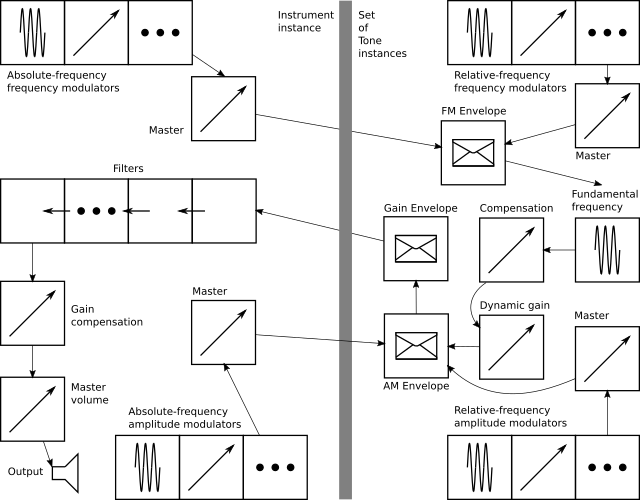

@numbering {
    enable: false
}

{title}Sound Builder, Web Audio Synthesizer

[*Sergey A Kryukov*](https://www.SAKryukov.org){.author}

*What works with Microsoft pen computing and what not? How to handle and recognize ink input for any supported language?*

<!-- <h2>Contents</h2> is not Markdown element, just to avoid adding it to TOC -->
<!-- change style in next line <ul> to <ul style="list-style-type: none"> -->
<!--
For CodeProject, makes sure there are no HTML comments in the area to past!

See: https://www.codeproject.com/script/Articles/ArticleVersion.aspx?waid=277187&aid=1278552&PageFlow=FixedWidth
Original publication:
https://www.codeproject.com/Articles/1278552/Anamorphic-Drawing-for-the-Cheaters

--> 

---

<!-- copy to CodeProject from here ------------------------------------------->

{id=picture.main}

<blockquote id="epigraph" class="FQ">
Epigraph:

<i>If something is prohibited but you badly want it, it is&hellip; permitted</i>

<dd>Folk wisdom</dd></blockquote>

@toc

## Motivation

The main driving force of thе present work is a severe need.

It is related to the repository of my work [Microtonal Music Study using specialized chromatic keyboards and Web Audio API](https://SAKryukov.github.io/microtonal-chromatic-lattice-keyboard).

Two article related to this topic are published as [Musical Study with Isomorphic Computer Keyboard](https://www.codeproject.com/Articles/1201737/Musical-Study-with-Isomorphic-Computer-Keyboard) and [Microtonal Music Study with Chromatic Lattice Keyboard](https://www.codeproject.com/Articles/1204180/Microtonal-Music-Study-Chromatic-Lattice-Keyboard). Even though first article has nothing to do with microtonal systems, it describes some basic theoretical explanation of the topic.

The second keyboard is _microchromatic_, very innovative, works in a Web browser with the use of [Web Audio API](https://developer.mozilla.org/en-US/docs/Web/API/Web_Audio_API). Recently, it used my heavily modified fork a third-party open-source library with very serious defects which I don't even want to discuss here. Anyway, it already played its role when the proof of concept goal was more important. These days, I continue research and development and cannot tolerate those defects and insufficient maintainability. But it's very hard or even impossible to find a decent open-source synthesizer satisfying all my requirements, so I've decided to develop my own. In other words, I started the work just because I [badly wanted](#epigraph) to get the result. Recently, I introduced my results to some prominent musicians, specialists in microtonal music, theory and pedagogics, and got very positive feedback. I think the tool is advanced, accurate and interesting enough to share it.

## Advanced features

The tool is a synthesizer synthesizer, or a generator of the instrument instances which can be exported in a form of an single JSON file, embedded in some other JavaScript code and used for implementation of an in-browser musical instrument based on Web Audio API, or some other tool for generation of music on a Web page. No part of the code uses any server-site operation, so any part of the code can be played locally on a wide range of devices, even without connection to Internet.

Some features of the tool are somewhat innovating. Overall, it helps to generate near-realistic instrument sound, in certain limited scope, using very interesting effect in a graphically manner using reasonably convenient UI. The user is not required to be able to work with audio nodes, to draw any graphics or understand Web Audio API. Instead, the procedure of the design of an instrument is based on filling data in several tables, possibly trial-and-error approach with listening the results of the synthesis advances.

The procedure of instrument authoring is started from a single oscillator defined be a Fourier spectrum. Such spectrum can be imported from a spectral analyser of an available code sample, but usually additional edition is required. Alternatively, traditional signal waveforms, such as sawtooth or triangle, are also available, but I personally don't use them.
n
On top of this the user can define unlimited number of modulators. A modulator can be used for frequency or amplitude modulation, and each of them can be either absolute-frequency or relative-frequency modulator. For absolute modulations, the user can define a fixed frequency for each one, but for relative-frequency modulations the frequency of the modulation signal depends on the fundamental frequency of each tone.

On top of this, the result of synthesis can be shaped using an envelope. Unlike conventional synthesis systems, in addition to a usual volume enveloped, there are three additional kinds of envelope: one for temporary detune, and two for modulations, separately for frequency and amplitude modulation.

On top of this, there is a set of filters with user-defined parameters. Any subset of filters can be included in use or excluded.

Finally, on top of this, there is a gain compensation system.

During the work, the author of an instrument uses a number of interactive tools used to listen to intermediate results. There is a test Jankó -style keyboard, corresponding to standard 88-key piano without one highest tone. The keyboard can be played with a mouse or by all 10 fingers using a touch screen. For both methods of playing, glissando is also possible, which is somewhat not very trivial technical aspect. Another important feature is this: during trial playing, any of the classes of the effects can be temporarily turned on, which is important for comparisons. Also, trial playing can be done with the control of volume, (additional) sustain and transposition. These controls are not parts of a resulting instruments and are designed specifically for the trial playing.

## A Word of Warning and a Disclaimer

Synthesis is such a thing... If you use this tool, please make sure you proceed carefully to protect your musical hearing from considerable shock. In some cases, accidental mistakes in parameters can produce awful almost traumatizing sound. I can see no chance to filter out bad things automatically, besides, it would be unfair.

I cannot assume any responsibility for production of bad or unpleasant sounds; this is a sole responsibility of a user. I only can assure that production of reasonably nice sounds is quite possible. Anyway, I provide a library of some instrument samples.

## Audio Graph

First of all, main design feature is this: all key of the on-screen keyboard should be able to generate sound at the same time. One may ask, why all of them, if we play with only 10 fingers? Simple: this is because of the sustain of an instrument. For example, if we press a sustain pedal of a piano and keep it down, we can, in principle, quickly hit all 88 strings, so at some moment of time all of them can generate sound, no matter how insane it may sound.

To achieve that, we have to dedicate considerable number of nodes to each and every instrument key. These parts of the graph are implemented by an object of a type `Tone`. However, we also minimize the number of those per-key nodes. It can be done by sharing some of our audio effects in another object of the type `Instrument`.

First, let's see what we can share. The set of filters can be shared. Some part of modulations can be shared, but some should be per key. I developed four kinds of modulation. We can apply unlimited number of frequency modulators (FM) and amplitude modulators (AM). Each of those modulators can be either absolute-frequency or relative frequency. All absolute-frequency modulators can be placed in the only `Instrument` and `Tone` instances can share them. But relative-frequency modulators modulate at some frequency different for each of the tones. In the tool, the actual frequency is the fundamental frequency of each tone, simply multiplied by some factor, with fixed modulation depths, individual for each modulators.

Therefore, both `Instrument` and `Tone` are based on the same type named `ModulatorSet`. For the implementation of a set of modulators, it does not matter which role role it plays, absolute-frequency of relative-frequency, implementation is the same.

Another per-tone part of the graph is a set of gain nodes used as targets for _envelopes_. An envelope is a mechanism used to program the dynamic behavior of a tone in its attack and damping. Customary synthesis technology usually implements only the envelope controlling volume, with fixed number of stages. The usual envelope is called [ADSR](https://en.wikipedia.org/wiki/Envelope_(music)) (Attack, Decay, Sustain and Release), but I don't even want to discuss it here, because it cannot satisfy me. Sound Builder has unified system of authoring envelopes of several types which makes possible creation of an envelope with unlimited number of stages, each stage characterized with its time, gain, and a choice of one of three functions. There are four characteristics of a node which can be envelope-programmed: volume, detune, AM and FM.

Now, we are ready to present a graph, starting with a tone part of it. First, let's introduce some graphical conventions.

 Oscillator node

 Gain node

 Envelope, gain node with gain controlled by envelope functions

 Modulator set

 Chain of nodes

 Output node

### Instrument

## Fourier-Defined Oscillator

## Envelopes

### Volume Envelope

This is the most traditional kind of envelope, which is used, for example, in ADSR. The difference is not only unlimited number of stages. Additional volume envelope characteristic is its dumping sustain. There is no such thing as instant stopping of a sound. It we try to produce such instantaneous stop, electronics not instantaneously, but very quickly, which, naturally, produces ultra-wide spectrum, which is perceived as very unpleasant crackling noise. The same thing can happen due too fast attack. I don't think any timing faster then some 10 ms can be practically used, so the envelope stage times are limited by this maximum duration. Dumping sustain happens when we play, for example, a piano and release a key. But what happens when we keep a key down or use a sustain key?

In this case, the behavior is defined by the last stage of an envelope. We can define essentially two different types of instruments. First type is suitable for the instrument with natural damping, such as piano or bells. For these instruments, the target value of the gain of the last stage should be zero, but the stage itself can be prolonged, say, up to several seconds. If we make this time about 10 milliseconds or few times greater, we can achieve the effect closer to some melodic percussion. The second type can model the instrument of "infinite" sound, such as in wind or bow string instruments. The target gain of the last envelope stage should be maximum, or about maximum value. In this case, the sound is damped only when a performer releases a key.

### Detune Envelope

It is pretty typical that an instrument plays somewhat detuned tone during limited period of time, especially during attack. For example, it happens in loud finger style guitar playing. At the first phase of plucking of the string, it is considerably elongated and hence sounds sharper then the tone it is tuned to. Besides, at first moment, a string can be pressed against the fret stronger. This effect can be achieved by controlling some detune value of the oscillator. Naturally, unlike the case of the volume, the detune value of the last stage should be zero.

### Modulation Envelopes

Two remaining envelopes are those separately controlling AM and FM, but I don't make distinction between absolute-frequency FM/AM and relative-frequency FM/AM. Instead, one envelope controls all AM and one --- all FM. Let's consider a typical case of such envelope. A tuba or a saxophone, as well as many other wind instruments, show extremely strong vibration when a performer starts to blow a sound, but the vibration becomes barely perceivable as the sound stabilizes. This can be achieved with these two kinds of envelope.

## Gain Compensation

Both kinds of design features of the instrument synthesis, additive synthesis based on Fourier spectrum, and subtractive synthesis based of filters, make the final volume of each tone hard to predict. Worst thing is: all tones produce very different subjective levels of volume, depending on the frequency. Overall volume of an instrument also can differ dramatic. Hence, some frequency-dependent gain compensation is badly needed. I've tried a good deal of research using different "clever" functions, but finally ended up with the simplest approach: quadratic spline defined by three points: some low frequency and compensation level for this frequency, some high frequency and compensation level for this frequency and some medium frequency point where the compensation is considered to be equal to 1. Naturally, two quadratic functions are stitched at this point. This simple function has the following benefit: one can compensate for part of the spectrum on right of this point, then, separately, on left part of the spectrum. When left or right part is done, compensation for another part won't spoil previous work.

This procedure requires a table of three parameters: low-frequency and high-frequency compensation and the position of the middle frequency, plus a value for overall compensation factor. Two values for low and high frequencies themselves are not presented in the table, because they rarely, if ever, need to be modified; they correspond to highest of lowers frequencies of a standard 88-key piano. However, they are prescribed in the data files (where the are written based on the code's definition set) and can be modified by some overly smart users. :-)

## Compatibility

The tool is tested on a good number of browsers and some different systems.

I found that, at the time of warning there is only one type of browsers with sufficient support of Web Audio API: those based on [V8](https://en.wikipedia.org/wiki/V8_engine) + [Blink](https://en.wikipedia.org/wiki/Blink_(browser_engine)) combination of engines. Good news is: the set if such browsers is pretty wide.

Unfortunately, Mozilla browsers, formally implementing full Web Audio API, produce pretty bad crackling noise which cannot be eliminated, in the situation when the operation of V8 + Blink combination is just fine. For the time being, the application prevents the use of these and some other browsers.

Here is the text of the recommendations which a page shows when a browser cannot cope with the task:

<blockquote id="epigraph" class="FQ">

This application requires JavaScript engine better conforming to the standard.

Browsers based on V8 engine are recommended, such as Chromium, Chrome, Opera, Vivaldi, Microsoft Edge v. 80.0.361.111 or later, and more…

</blockquote>

By the way, my congratulations to Microsoft people for their virtue of giving up majorly defunct [EdgeHTML](https://en.wikipedia.org/wiki/EdgeHTML) used for [Edge](https://en.wikipedia.org/wiki/Microsoft_Edge) until 2020. :-)

## Conclusions

Enjoy! :-)
<!-- copy to CodeProject to here --------------------------------------------->
