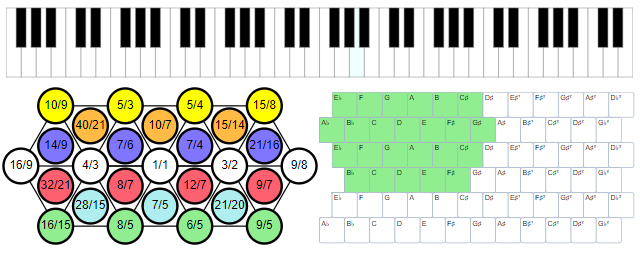

@numbering {
    enable: false
}

{title}Multitouch Support for Ten-Finger Playing

[*Sergey A Kryukov*](https://www.SAKryukov.org)

Microtonal Fabric uses multitouch screen support for musical keyboards

If a multitouch screen is available, the user can play music with Microtonal Fabric applications with ten fingers, play chords, glissando, and use other techniques in all combinations. Microtonal Fabric uses a unified approach to cover the handling of the musical on-screen keyboards and more. The present article offers an easy-to-use yet comprehensive API suitable not only to Microtonal Fabric but a wide class of applications.

<!-- <h2>Contents</h2> is not Markdown element, just to avoid adding it to TOC -->
<!-- change style in next line <ul> to <ul style="list-style-type: none"> -->
<!--
For CodeProject, makes sure there are no HTML comments in the area to past!


266D ♭music flat sign
266E ♮ music natural sign
266F ♯ music sharp sign
¹²
C &mdash; D♭² &mdash; Db &mdash; C♯ &mdash; C♯² &mdash; D 

--> 

---

Download Microtonal Fabric source code — 284 KB

<!-- copy to CodeProject from here ------------------------------------------->

<p id="image-title">



</p>

## Contents{no-toc}

@toc

## Introduction

This is the fourth article of the series dedicated to musical study with on-screen keyboards, including microtonal ones:

1. *[Musical Study with Isomorphic Computer Keyboard](https://www.codeproject.com/Articles/1201737/Musical-Study-with-Isomorphic-Computer-Keyboard)*
2. *[Microtonal Music Study with Chromatic Lattice Keyboard](https://www.codeproject.com/Articles/1204180/Microtonal-Music-Study-Chromatic-Lattice-Keyboard)*
3. *[Sound Builder, Web Audio Synthesizer](https://www.codeproject.com/Articles/5268512/Sound-Builder)*
4. *Present article*

The last three articles are devoted to the project named [Microtonal Fabric](https://github.com/SAKryukov/microtonal-fabric), a  microtonal music platform based on [WebAudio API](https://developer.mozilla.org/en-US/docs/Web/API/Web_Audio_API). It is a framework for building universal or customized microtonal musical keyboard instruments, microtonal experiments and computing, music study, and teaching music lessons with possible remote options. The platform provides several applications executed in a Web browser using shared JavaScript components.

See also [my page](https://en.xen.wiki/w/Sergey_A_Kryukov) at the microtonal community Web site [Xenharmonic Wiki](https://en.xen.wiki). In addition to the Microtonal Fabric links, there are some useful links on different microtonal topics and personalities.

Most of the Microtonal Fabric applications allow the user to play music in a browser. If a multitouch screen is available, the user can play with ten fingers. The required features of the multitouch interface are not as trivial as they may seem at first glance. The present article explains the problem and the solution. It shows how the multitouch behavior is abstracted from the other part of the code, reused, and utilized by different types of on-screen keyboards.

In the approach discussed, the application of the present multitouch solution is not limited to musical keyboards. The *view model* of the keyboard looks like a collection of HTML or SVG elements with two states: "activated" (down) or "deactivated" (up). The states can be modified by the user or by software in many different ways. First, let's consider the entire problem.

## The Problem: Keyboard Keys are not Like Buttons!

So, why does the multitouch control of the keyboard present some problems? Well, mostly because the inertia of thinking could lead us in the wrong direction.

The most usual approach is to take the set of keys of some keyboard and attach some event handler to each one. It looks natural, but it cannot work at all.

Let's see what playing with all ten fingers requires. On a screen, we have three kinds of area: 1) the area of some keyboard key, 2) the area of a keyboard not occupied by a key, and 3) the area outside the keyboard. When one or more fingers touch the screen inside the area of some key (case #1), a [Touch object](https://developer.mozilla.org/en-US/docs/Web/API/Touch) is created. The low-level touch event is invoked, but a semantic-level keyboard event to be handled to invoke key activation should be invoked only if there are no more `Touch` objects in the area of the given key. Likewise, when a finger is removed from the screen, a semantic-level keyboard event should be invoked only if there are no other `Touch` objects in the area of the key.

But this is not enough. The key activation can also be changed if a finger just slides on the screen. When a sliding finger enters the area or leaves the area of some key, it can come from or move to any of the areas of types #1 to #3. Depending on the presence of other `Touch` objects in the area of the given key, it can also change the activation state of this key. Most typically, it happens when fingers slide across two or more keys. This technique is known as *glissando*. And this is something that cannot be implemented when  [touch events](https://developer.mozilla.org/en-US/docs/Web/API/Touch_events) are attached to each key separately.

Why? It's easy to understand by comparison with the [pointer events](https://developer.mozilla.org/en-US/docs/Web/API/Pointer_events). These events include the events `pointerleave` and `pointerout`. These events make perfect sense for a single pointer controlled by a mouse or a touchpad. However, there is nothing similar in [touch events](https://developer.mozilla.org/en-US/docs/Web/API/Touch_events). The keyboard keys do not at all behave like UI buttons. Despite the apparent similarity, they are totally different.

The only way to implement all the combinations of the semantic-level multitouch events is to handle low-level [touch events](https://developer.mozilla.org/en-US/docs/Web/API/Touch_events) to some element containing all the keys. In Microsoft Fabric code, this is the element representing the entire keyboard. Let's see how it is implemented in the section [Implementation](#heading-implementation) [Multitouch](#heading-multitouch).

Before looking at the implementation, the reader may want to look at the available Microtonal Fabric applications using multitouch control. For all the applications, *live play* is available. For each application, the live play URL can be found below. 

## Microtonal Fabric Applications Using Multitouch Control

<table>
<tr><th>Application</th><th>Source code</th><th>Live play</th></tr>
<tr><td>Multi-EDO</td><td>./Multi-EDO</td><td><a href="https://sakryukov.github.io/microtonal-fabric/code/Multi-EDO">Multi-EDO</a></td></tr>
<tr><td>29-EDO</td><td>./29-EDO</td><td><a href="https://sakryukov.github.io/microtonal-fabric/code/29-EDO">29-EDO</a></td></tr>
<tr><td>Microtonal Playground</td><td>./playground</td><td>
    <a href="https://sakryukov.github.io/microtonal-fabric/code/playground?user.data">Aura's Diatonic Scales</a><br/>
    <a href="https://sakryukov.github.io/microtonal-fabric/code/playground?custom/12-EDO.user.data">Common-practice 12-EDO</a><br/>
    <a href="https://sakryukov.github.io/microtonal-fabric/code/playground?custom/shruti.user.data">Shruti Scales</a><br/>
    <a href="https://sakryukov.github.io/microtonal-fabric/code/playground?custom/chinese.user.data">Traditional Chinese Tonal System</a><br/>
    <a href="https://sakryukov.github.io/microtonal-fabric/code/playground?custom/customized.user.data">Microtonal Playground Customization Demo</a><br/>
</td></tr>
<tr><td><a href="https://en.xen.wiki/w/Color_notation#Interval_Names">Kite Giedraitis keyboard</a><br/>(under development)</td><td>./Kite.Giedraitis</td><td><a href="https://sakryukov.github.io/microtonal-fabric/code/Kite.Giedraitis">Kite Giedraitis</a></td></tr>
</table>

## Implementation

The idea is: we need a separate unit abstracted from the set of UI elements representing the keyboard. We are going to set some [touch events](https://developer.mozilla.org/en-US/docs/Web/API/Touch_events) to the single HTML or SVG control representing the entire keyboard. These events should be interpreted by some events that may or may not be related to the keyboard keys. To pull the information on the keys from the user, we are going to use *inversion of control*.

The touch functionality is implemented by attaching the events to some element representing an entire keyboard using the single call to the function `setMultiTouch`, and it gets the key configuration information and invokes the semantic-level key events through three callback handers. Let's see how it works. 

### Multitouch

The function `setMultiTouch` assumes the following UI model of the multitouch sensitive area: a `container` HTML or SVG element containing one or more HTML or SVG child elements, they can be direct or indirect children.

The function accepts four input arguments, `container`, and three handlers:

- `container`: HTML or SVG handling multitouch events
- `elementSelector`: the handler to select relevant children in `container`.
<br/>
Profile: `element => bool`
<br/>If this handler returns `false`, the event is ignored. Essentially, this handler is used by the user code to define the HTML or SVG elements to be interpreted as keys of some keyboard represented by the `container`.
- `elementHandler`: the handler used to implement main keyboard functionality.
<br/>Profile: `(element, Touch touchObject, bool on, touchEvent event) => undefined`
<br/>The handler is used to implement the main functionality, for example, produce sounds in response to the keyboard events; the handler accepts `element`, a touch object, and a Boolean `on` argument showing if this is an "on" or "off" action. Basically, this handler calls a general semantic handler which can be triggered in different ways, for example, through a keyboard or a mouse. Essentially, it implements the action triggered when a keyboard key, represented by `element` is activated or deactivated, depending on the value of `on`.
- `sameElementHandler`: the handler used to handle events within the same element representing a key touch events.
<br/>Profile: `(element, Touch touchObject) => undefined` 

"ui.components/multitouch.js":{id=code-multitouch}

```{lang=JavaScript}
"use strict";

const setMultiTouch = (
    container,
    elementSelector,
    elementHandler,
    sameElementHandler,
) =&gt; {

    if (!elementSelector)
        return;
    if (!container) container = document;

    const assignEvent = (element, name, handler) =&gt; {
        element.addEventListener(name, handler,
            { passive: false, capture: true });
    };
    const assignTouchStart = (element, handler) =&gt; {
        assignEvent(element, "touchstart", handler);
    };
    const assignTouchMove = (element, handler) =&gt; {
        assignEvent(element, "touchmove", handler);
    };
    const assignTouchEnd = (element, handler) =&gt; {
        assignEvent(element, "touchend", handler);
    };

    const isGoodElement = element =&gt; element && elementSelector(element); 
    const elementDictionary = {};
    
    const addRemoveElement = (touch, element, doAdd, event) =&gt; {
        if (isGoodElement(element) && elementHandler)
            elementHandler(element, touch, doAdd, event);
        if (doAdd)
            elementDictionary[touch.identifier] = element;
        else
            delete elementDictionary[touch.identifier];
    }; //addRemoveElement

    assignTouchStart(container, ev =&gt; {
        ev.preventDefault();
        if (ev.changedTouches.length < 1) return;
        const touch = ev.changedTouches[ev.changedTouches.length - 1];
        const element =
            document.elementFromPoint(touch.clientX, touch.clientY);
        addRemoveElement(touch, element, true, ev);    
    }); //assignTouchStart
    
    assignTouchMove(container, ev =&gt; {
        ev.preventDefault();
        for (let touch of ev.touches) {
            let element =
                document.elementFromPoint(touch.clientX, touch.clientY);
            const goodElement = isGoodElement(element); 
            const touchElement = elementDictionary[touch.identifier];
            if (goodElement && touchElement) {
                if (element == touchElement) {
                    if (sameElementHandler)
                        sameElementHandler(element, touch, ev)
                        continue;
                    } //if same
                addRemoveElement(touch, touchElement, false, ev);            
                addRemoveElement(touch, element, truem, ev);
            } else {
                if (goodElement)
                    addRemoveElement(touch, element, goodElement, ev);
                else
                    addRemoveElement(touch, touchElement, goodElement, ev);
            } //if    
        } //loop
    }); //assignTouchMove
    
    assignTouchEnd(container, ev =&gt; {
        ev.preventDefault();
        for (let touch of ev.changedTouches) {
            const element =
                document.elementFromPoint(touch.clientX, touch.clientY);
            addRemoveElement(touch, element, false, ev);
        } //loop
    }); //assignTouchEnd

};
```

The central point of the `setMultiTouch` implementation is the call to [document.elementFromPoint](https://developer.mozilla.org/en-US/docs/Web/API/Document/elementFromPoint). This way, the elements related to the [Touch event data](https://developer.mozilla.org/en-US/docs/Web/API/Touch) are found. When an element is found, it is checked up whether this is the element representing a keyboard key, and the function `isGoodElement` does that using the handler `elementSelector`. If it is, the handler `elementHandler` or `sameElementHandler` is called, depending on the event data. These calls are used to handle [touch events](https://developer.mozilla.org/en-US/docs/Web/API/Touch_events) `"touchstart"`, `"touchmove"`, and `"touchend"`.

Let's see how `setMultiTouch` can be used by applications.

### Usage Examples

A very typical usage example can be found in the application 29-EDO. It provides several keyboard layouts and two different tonal systems (29-EDO and a common-practice 12-EDO), but the keyboards reuse a lot of common code. For all the keyboard layouts `elementSelector` is based on the fact that all the keyboard keys are rectangular SVG elements [SVGRectElement](https://developer.mozilla.org/en-US/docs/Web/API/SVGRectElement), but the keyboards are not, they are represented by an SVG element, [SVGSVGElement](https://developer.mozilla.org/en-US/docs/Web/API/SVGSVGElement).

Also, the keyboards have a common semantic-level handler `handler(element, on)`, it controls highlighting and audio action of a key represented by `element`, depending on its Boolean activation state `on`. This is a common handler used via the touch API and [pointer API](https://developer.mozilla.org/en-US/docs/Web/API/Pointer_events). The handler can also be activated by the code through a computer keyboard or other control elements. In particular, it can be called by the Microtonal Fabric sequence *recorder*. It makes the call to `setMultiTouch` pretty simple:

"29-EDO/ui/keyboard.js":{id=code-29-edo}

```{lang=JavaScript}
setMultiTouch(
    element,
    element => element.constructor == SVGRectElement,
    (element, _, on) =&gt; handler(element, on));
```

Here, the first `element` represents a keyboard, an [SVGRectElement](https://developer.mozilla.org/en-US/docs/Web/API/SVGRectElement), and the `element` arguments of the handlers represent the keyboard keys.

In another place the expression `element.constructor == SVGCircleElement` is used, for the application having only round-shaped keys.

There is a more dedicated example where the selection of the key element is performed by a method of some abstract JavaScript class.

"ui.components/abstract-keyboard.js":{id=code-abstract-keyboard}

```{lang=JavaScript}
class AbstractKeyboard {
    //...
    setMultiTouch(
        parentElement,
        keyElement => this.isTouchKey(parentElement, keyElement),
        (keyElement, _, on) => handler(keyElement, on));
}
```

This second example is more interesting from a programming standpoint. Let's discuss it in more detail.

### Abstract Keyboard

The [last example](#code-abstract-keyboard) shows an additional abstraction layer: the universal piece of code setting up the multitouch features is placed once in a class representing an abstract keyboard. Potentially, more than one terminal keyboard class can be derived from `AbstractKeyboard` and reuse the multitouch setup and other common keyboard features.

In the class `AbstractKeyboard`, the functions used in the call to `setMultiTouch` are not fully defined: the function `this.isTouchKey` is not defined at all, and the function `handler` is defined, but it depends on not yet functions. These functions are supposed to be implemented in all the terminal classes derived from `AbstractKeyboard`. But how to guarantee it?

To guarantee, I've put forward a new technique I called *interface* ("agnostic/interfaces.js"). The keyboard classes do not extend an appropriate interface class, they just implement proper functions defined in a particular interface, a descendant class of the class `IInterface` (agnostic/interfaces.js"). The only purpose of `IInterface` is to provide a way of early detection of the problem due to the lack of full implementation of an interface to some degree of *strictness*. To understand the concept of strictness, please see `const IInterfaceStrictness` in the same file, it is self-explaining.

In the example of the application Microtonal Playground, the terminal keyboard class implements the multitouch behavior not directly by calling `setMultiTouch`, but by inheriting from `AbstractKeyboard` through the following inheritance diagram: 

`AbstractKeyboard` ("ui.components\abstract-keyboard.js") &#x25C1;&#x2500; `GridKeyboard` ("ui.components\grid-keyboard.js") &#x25C1;― `PlaygroungKeyboard` ("playground\ui\playground-keyboard.js")

In addition to the inheritance from `AbstractKeyboard`, the terminal class is supposed to implement `IKeyboardGeometry`:

`IInterface` ("agnostic/interfaces.js") &#x25C1;&#x2014; `IKeyboardGeonetry` ("ui.components\abstract-keyboard.js")

"ui.components\abstract-keyboard.js":{id=code-ikeyboardgeometry}

```{lang=JavaScript}
class IKeyboardGeometry extends IInterface {
    createKeys(parentElement) {}
    createCustomKeyData(keyElement, index) {}
    highlightKey(keyElement, keyboardMode) {}
    isTouchKey(parentElement, keyElement) {} // for touch interface
    get defaultChord() {} // should return array of indices of keys in default chord
    customKeyHandler(keyElement, keyData, on) {} // return false to stop embedded handling
}
```

The implementation of this interface guarantees that the functions of `AbstractKeyboard` work correctly, and the fact that the implementation of `IKeyboardGeometry` is fully implemented is validated by the constructor of the class `AbstractKeyboard`.

This validation is throwing an exception in case the implementation of the interface is not satisfactory:{id=code-test-interface-implementation}

```{lang=JavaScript}
class AbstractKeyboard {

    #implementation = { mode: 0, chord: new Set(), playingElements: new(Set), chordRoot: -1, useHighlight: true };
    derivedImplementation = {};
    derivedClassConstructorArguments = [undefined];

    constructor(parentElement, ...moreArguments) {
        IKeyboardGeometry.throwIfNotImplemented(this);
        this.derivedClassConstructorArguments = moreArguments;
        //...
    }

    //...

}
```

For the detail of `IInterface.throwIfNotImplemented` please see the source code, "agnostic/interfaces.js". The validation of the interface implementation is based on the reflection of the terminal class performed during runtime by the constructor. It checks up all the interface functions, property getters, and setters, and, depending on required strictness, the number of arguments for each function. In our case, it happens during the construction of the terminal application-level class `PlaygroungKeyboard` of the application Microtonal Playground. The application itself deserves a separate article.

Apparently, this is just the imitation of the interface mechanism found in some well-designed compiled languages. It validates the implementation of the interfaces later, during runtime, but as soon as possible. Naturally, the mechanism cannot change the behavior of the software, it only facilitates debugging and, hence, software development. The mechanism does work, but I consider it experimental and do understand that its value is discussible. I would be grateful for any criticism or suggestions. 

### Using Extra Data

Note that none of the examples uses the second argument parameter of the handler `handler`, accepted as the second `setMultiTouch` argument, the argument `touchObject` of the [Touch](https://developer.mozilla.org/en-US/docs/Web/API/Touch) type. Also, the last argument of `setMultiTouch`, the handler `sameElementHandler` is not used. However, these arguments are fully functional and can be used. They are reserved for advanced use.

The `Touch` argument passed to `handler` is used to get additional information on the original touch event. In particular, I've tried to use the values [Touch.radiusX](https://developer.mozilla.org/en-US/docs/Web/API/Touch/radiusX) and [Touch.radiusY](https://developer.mozilla.org/en-US/docs/Web/API/Touch/radiusY). My idea was to evaluate the area of the contact of the touchscreen with a finger. This information could be used to derive an amount of pressure, and hence, adjust sound volume based on this value, to add some dynamics to the performance. However, my experiments demonstrated that the performer poorly controls this value, and it is not the same as actual pressure. The more principle problem of those [Touch](https://developer.mozilla.org/en-US/docs/Web/API/Touch) member properties is that their change does not trigger any touch events; an event is triggered only when the centroid of the touch is changed. Nevertheless, it is obvious that the `Touch` data can be useful for the implementation of some advanced effects.

The argument `sameElementHandler` of the function `setMultiTouch` is called when a touch event is triggered when a location of the touch remains within the same `element` as a previous touch event. Apparently, such events should not modify the activation state of the `element`. At the same time, such events can be used for the implementation of finer techniques. For example, the motion of a finger within the same key can be interpreted as finger-controlled *vibrato*. 

All the finer techniques mentioned above are a matter of further research.

## Compatibility

Microtonal Fabric functionality is based on advanced and modern JavaScipt and browser features and may fail when used with some Web browsers. Basically, it works correctly with all [Chromium](https://en.wikipedia.org/wiki/Chromium_(web_browser))-based browsers, or, more exactly, the modern browsers based on [Blink](https://en.wikipedia.org/wiki/Blink_(browser_engine)) and [V8](https://en.wikipedia.org/wiki/V8_(JavaScript_engine)) engines. It means [Chromium](https://en.wikipedia.org/wiki/Chromium_(web_browser)), [Chrome](https://en.wikipedia.org/wiki/Google_Chrome), and some other derived browsers. Even the latest "Anaheim" [Microsoft Edge](https://en.wikipedia.org/wiki/Microsoft_Edge#New_Edge_(2019–present)) works correctly.

Unfortunately, the present-day [Mozilla browsers](https://en.wikipedia.org/wiki/Firefox) manifest some problems and cannot correctly run the Microtonal Fabric application. In particular, [Firefox](https://en.wikipedia.org/wiki/Firefox) for Linux does not properly handle the [touch events](https://developer.mozilla.org/en-US/docs/Web/API/Touch_events) described in the present article. Microtonal Fabric users and I keep an eye on compatibility, so I’ll try to update compatibility information if something changes.

## Conclusions

We have a mechanism and an abstraction layer to be used as a semantic wrapper around a more general touch API, which is closer to the touchscreen hardware. This layer presents the events in а form adequate to the *view model* of an on-screen keyboard or other UI elements similar in functionality. The code using this layer calls a single function `setMultiTouch` and passes its semantic handlers.

Optionally, on top of this layer, the user can use a more specific and potentially less universal API based on `IKeyboardGeometry` and JavaScript classes.

These two options present a comprehensive semantic-level mechanism for the implementation of all aspects of the behavior of on-screen keyboards based on a multitouch touchscreen. At the same time, it leaves the UI open to other input methods, such as a physical computer keyboard, mouse, or touchpad.

<!-- copy to CodeProject to here --------------------------------------------->
