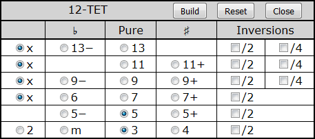

Microtonal Music Study with Chromatic Lattice Keyboard

[*Sergey A Kryukov*](https://www.SAKryukov.org)

A pure in-browser application as a tool for learning advanced music harmony with different tone system 

<!-- <h2>Contents</h2> is not Markdown element, just to avoid adding it to TOC -->
<!-- change style in next line <ul> to <ul style="list-style-type: none"> -->
<!--
For CodeProject, makes sure there are no HTML comments in the area to past!

266D ♭music flat sign
266E ♮ music natural sign
266F ♯ music sharp sign
¹²
C &mdash; D♭² &mdash; Db &mdash; C♯ &mdash; C♯² &mdash; D 

--> 

---

<!-- copy to CodeProject from here ------------------------------------------->

{id=image.title}

## Contents

## Introduction

This is the second article  in the series dedicated to musical study using specialized keyboards based on the computer keyboard:

1. Present article
2. *[Musical Study with Isomorphic Computer Keyboard](https://www.codeproject.com/Articles/1201737/Musical-Study-with-Isomorphic-Computer-Keyboard)*
 
 In my [previous article](https://www.codeproject.com/Articles/1201737/Musical-Study-with-Isomorphic-Computer-Keyboard), I tried to explain very basic mathematical and physical aspects of music and put forward a keyboard structured to be very suggestive of music harmony. However, the application illustrates everything on much less general case of common-practice [common-practice](https://en.wikipedia.org/wiki/Common_practice_period) [tone system](https://en.wikipedia.org/wiki/Musical_tuning).

The application I introduce in the present article covers this case, but is mainly focused on [microtonal](https://en.wikipedia.org/wiki/Microtonal_music) systems. It provides more flexible ways for the very basic study of the field. I will often refer to certain points in my previous article. In the present article, I'm not going to get into theoretical reasoning much, mostly because my own study of the microtonal music is only starting.

[GitHub project](https://github.com/SAKryukov/microtonal-chromatic-lattice-keyboard)

[Live play](https://sakryukov.github.io/microtonal-chromatic-lattice-keyboard)

## Why Microtonal?

There can be very [many answers](http://xenharmonic.wikispaces.com/Why+use+alternative+tunings%3F) to this question. Not trying to cover the topic, I'll try to point out, maybe in a naive and rough way, two aspects I consider the most fundamental:

1. Traditional Western [equal-temperament](https://en.wikipedia.org/wiki/Equal_temperament) faces serious problems. Strictly speaking, its harmony does not sound quite harmonically. Basic sense of harmony is based on fundamental physical and mathematical principles independent from particular culture. At the same time, [transpositional equivalence](https://en.wikipedia.org/wiki/Transposition_%28music%29#Transpositional_equivalence) is impossible to achieve with strict harmonics — In my previous article, [I tried to explain it](https://www.codeproject.com/Articles/1201737/Musical-Study-with-Isomorphic-Computer-Keyboard#heading.rational-and-irrational-numbers). However hearing the defects require pretty well-trained ear. So, here is the first principle: with microtonal systems, it's possible to play music, which sounds very traditional, but more with improved harmony. At the same time, it's possible to play something very different from and unusual -- let's proceed to the second point. 

2. How about the possibility to create really new music? From the first glance, it may sound impossible. I often heard from people, including musicians, that such music is awfully "out of tune". Is it, really? I think, it depends. It can sound totally [xenharmonic](https://en.wikipedia.org/wiki/Xenharmonic_music), but it really depends on the listener. The ability to perceive microtonal music can be limited by too strong bonding with current cultural environment. The musical sense is a complicated combination of fundamental laws of nature and culture — I also [tried to explain it](https://www.codeproject.com/Articles/1201737/Musical-Study-with-Isomorphic-Computer-Keyboard#heading.culture-versus-physics), very roughly. It simply means that understanding of anything which can be called music always required involvement in culture and a lot of experience. Microtonal music just needs involvement in wider cultural context and even more experience.

## Supported Tone Systems
- [Just Intonation](https://en.wikipedia.org/wiki/Just_intonation) (only [presented](https://sakryukov.github.io/microtonal-chromatic-lattice-keyboard/tone-system-comparison/tone-system-comparison.html) on the [chromatic-circle](https://en.wikipedia.org/wiki/Chromatic_circle) keyboard)
- [Common-practice](https://en.wikipedia.org/wiki/Common_practice_period) [12-TET](https://en.wikipedia.org/wiki/Equal_temperament)
- [19-TET](https://en.wikipedia.org/wiki/19_equal_temperament)
- [31-TET](https://en.wikipedia.org/wiki/31_equal_temperament).

## Features
- For three chromatic tone systems, the same keyboard is used; the choice of tone system can be changed dynamically
- Due to the very special keyboard layout, basic playing skills acquired and techniques learned for one tone system are immediately applicable to other tone systems
- Side-by-side comparison of the sound of tones and chords in different tone systems
- Choice of 5 instruments or 4 basic waveforms
- Chord generation
- Optional chord visualization
- Compatible browsers include, but not limited to Google Chrome, Mozilla Firefox, Mozilla SeaMonkey and Opera.

## Using the Application

The application could be considered as two independent [single-page applications](https://en.wikipedia.org/wiki/Single-page_application), not counting [index file](https://sakryukov.github.io/microtonal-chromatic-lattice-keyboard) simply referencing the matter involved. Implementations share some of JavaScript files, that's it.

1. First part: [Microtonal Tone Systems Comparison](https://sakryukov.github.io/microtonal-chromatic-lattice-keyboard/tone-system-comparison/tone-system-comparison.html) based on four chromatic-circle keyboards. Chords can be defined directly on the chromatic-circle keyboard and played separately on in fast succession comparison.
2. Second part: [Microtonal Chromatic Lattice](https://sakryukov.github.io/microtonal-chromatic-lattice-keyboard/keyboard/keyboard.html) keyboard, which allows to play wide range of tones. Chords can be defined through chord tables, auto-generated and played with single click or key press. 

The full source code can be downloaded, but there is no a need to download software to use it — everything can be played directly on the application [Web site](https://sakryukov.github.io/microtonal-chromatic-lattice-keyboard).

### Microtonal Tone Systems Comparison

On [this page](https://sakryukov.github.io/microtonal-chromatic-lattice-keyboard/tone-system-comparison/tone-system-comparison.html), all round shapes can be used as musical instrument keys. Lower octaves are closer to the center.
Central areas are used to play chords. The round shapes at the center are hidden and are visualized when at least one note is added to a chord. Shift+note toggles a note of a chord (double click to clears the chord). For example, the [picture on the top](#image.title) shows an inversion of the harmonic seventh chord, at the moment of playing, in [31-TET](https://en.wikipedia.org/wiki/31_equal_temperament) system. 

The chords can be played by clicking at the center round areas. Besides, if more than two chords are selected, two different temperaments can be listened in fast alteration on the special control "<u>C</u>ompare (Ctrl+ &larr; &rarr;)". When sound is activated, moving a mouse pointer between two halves quickly alters the chords:

Now, lets consider the circular keyboards to be used for study of different tone systems.

[Just Intonation](https://en.wikipedia.org/wiki/Just_intonation):

Just intonation is shown in comparison with the positions of [Common-practice](https://en.wikipedia.org/wiki/Common_practice_period) [12-TET](https://en.wikipedia.org/wiki/Equal_temperament) *semitones* depicted as gray radial lines. This picture reveals the bigger problem of tuning accuracy of 12-TET: pure rendering of 6th and, even more importantly, 3rd, which is the central note of very important [major chord](https://en.wikipedia.org/wiki/Major_chord). The errors are 15.6 [cents](https://en.wikipedia.org/wiki/Cent_%28music%29) for 6th and 13.7 for 3rd. Probably, most people can hear the pretty subtle difference, perhaps after certain training, but the difference becomes more apparent in cases where inter-string resonances of the instruments (like piano or guitar) are noticeable.

I want to remind that [Just Intonation](https://en.wikipedia.org/wiki/Just_intonation) is based on pure [harmonic relationships]((https://www.codeproject.com/Articles/1201737/Musical-Study-with-Isomorphic-Computer-Keyboard#heading.rational-and-irrational-numbers)) between tones, is very important for comparison of tone systems, but is fairly impractical for playing of most musical pieces due to the lack of [transpositional equivalence](https://en.wikipedia.org/wiki/Transposition_%28music%29#Transpositional_equivalence).

[12-TET](https://en.wikipedia.org/wiki/Equal_temperament):

[19-TET](https://en.wikipedia.org/wiki/19_equal_temperament):

With [19-TET](https://en.wikipedia.org/wiki/19_equal_temperament), th two different intervals between the degrees of [major scale](https://en.wikipedia.org/wiki/Major_scale): 2 (for B-C and E-F intervals) or 3 microtones. So, there is only one kind of sharp and one kind of flat, &plusmn;1 microtone. However, I avoid using ♯ and ♭ inside minor second intervals, to avoid the choice between [enharmonically equivalent](https://en.wikipedia.org/wiki/Enharmonic) notations, because, in microtonal systems, enharmonic equivalence generally cannot be assumed -- it is not the case for the 3-microtone minor second intervals.

[31-TET](https://en.wikipedia.org/wiki/31_equal_temperament):

With [31-TET](https://en.wikipedia.org/wiki/31_equal_temperament), there are two sharp and flat intervals, 2 and 4 microtones. "Inverted" order of ♯ and ♭ is not a mistake, because they are sharp and flat based on different notes. For example, all the tones in C to D and B to C intervals are:

C &mdash; D♭² &mdash; Db &mdash; C♯ &mdash; C♯² &mdash; D
B &mdash; C♭ &mdash; B♯ &mdash; C

Here, I denoted "double flat" (also known as half-sharp if counted from C) as D♭² and (also known as half-flat if counted from D) C♯². The Unicode characters for half/double sharp/flat are not standardized (and many other characters for musical notation are not implemented be default on most systems), so I decided to use my own notation, which is not shown on small keys.

This way, there is only one kind of ♯ and one kind of ♭: &plusmn;2 microtones.

So, there are two different intervals between the degrees of [major scale](https://en.wikipedia.org/wiki/Major_scale): either 5 or 3 (between B and C and between E and F) microtones. It makes 31 microtones and very good rendering of [major scale](https://en.wikipedia.org/wiki/Major_scale). At the same time altered intervals and chord can sound very differently.  

Another way to define a chord is based on the degrees of the scale, chosen from a table.{id=special.chord-tables}

This is the example of the table for [19-TET](https://en.wikipedia.org/wiki/19_equal_temperament) showing the default selection of [major chord](https://en.wikipedia.org/wiki/Major_chord):

For [31-TET](https://en.wikipedia.org/wiki/31_equal_temperament), the table is wider, because two more columns are added: "Double ♯" and "Double ♭".

For [Just Intonation](https://en.wikipedia.org/wiki/Just_intonation) and [12-TET](https://en.wikipedia.org/wiki/Equal_temperament), I imposed some constraints to keep the chords matching the definition for "valid" chord accepted as modern music term. For example, for [12-TET](https://en.wikipedia.org/wiki/Equal_temperament) there major/minor/diminished/augmented triad is always either present or replaced with sus2 or sus4 — look at the last line:

This is not the case for microtonal systems. For consistency, generalization and simplification, any subset of notes can be chosen, even the empty set, but no more than one alteration per zone. Note that 6th and 7th zones are not united for microtonal systems, because generally there is no [enharmonically equivalent](https://en.wikipedia.org/wiki/Enharmonic) between 6th and 7&minus;; by the same reasons, there are no empty table cells for altered notes.

The chord [inversions](https://en.wikipedia.org/wiki/Inversion_(music)) are created by the check boxes "/2" and "/4", which lower a note by one or two octaves. 

The same system of chord selection, based on shared JavaScript code, is used for "big" chromatic lattice keyboard. Such selection provides the only way to play a chord in one click.

### Microtonal Chromatic Lattice

Basically, the idea of the keyboard structure is based on [Wicki-Hayden layout](https://en.wikipedia.org/wiki/Wicki-Hayden_note_layout), but the geometry is different. Instead of being hexagonal, it is rectangular, which is simpler and better matches the symmetry of the grid of tone relationships.

The keyboard takes the same share, dimensions and structure as the one offered in the [previous article](https://www.codeproject.com/Articles/1201737/Musical-Study-with-Isomorphic-Computer-Keyboard). Its *fragment* is shown for [31-TET](https://en.wikipedia.org/wiki/31_equal_temperament):

The green area is used to play part of the tones using the physical computer keyboard (sorry, modeled based on standard US keyboard layout, without any options; anyone who really needs something else is welcome to address me).

The controls are different. First of all, one of the three tone systems and four layout ([12-TET](https://en.wikipedia.org/wiki/Equal_temperament), 12-TET in [Jankó layout](https://en.wikipedia.org/wiki/Jank%C3%B3_keyboard), [19-TET](https://en.wikipedia.org/wiki/19_equal_temperament) and [31-TET](https://en.wikipedia.org/wiki/31_equal_temperament)) can be chosen at any time.

Other controls enable optional highlighting of chords (played prefixed with Ctrl+) and chosen from the tables [described above](special.chord-tables) and chord note marking using the scale degree notation.

First surprising thing is that the tone layout looks nearly identical to that of 12-TET. This layout is very special: 1) it is very suggestive of harmonic relationship between notes, 2) the layouts for different tone systems are "locally identical". The differences become apparent, for example, in the attempt to perform [harmonic modulation](https://en.wikipedia.org/wiki/Modulation_%28music%29), which is very easy though, due to chromatic nature of the keyboard. How it works?

Here is how the layout is structured:

The intervals in semitones depend on the tone system:

<table class="grid">
<tr>
<td>12-TET</td><td>K=2</td><td>L=5</td><td>M=7</td>
</tr>
<tr>
<td>12-TET</td><td>K=3</td><td>L=8</td><td>M=11</td>
</tr>
<tr>
<td>12-TET</td><td>K=5</td><td>L=13</td><td>M=18</td>
<tr>
</table>

Obviously, the ratio values 3/2, 4/3 and 9/8 are only approximated by microtonal intervals, because rational frequency ratio values are [impossible with equal temperaments](https://www.codeproject.com/Articles/1201737/Musical-Study-with-Isomorphic-Computer-Keyboard#heading.rational-and-irrational-numbers).

## Implementation

### Sound Synthesis

First of all, sound synthesis it totally based on [Web Audio API](https://developer.mozilla.org/en-US/docs/Web/API/Web_Audio_API) implemented by nearly all major browsers. Presently, it is based on the [W3C working draft of August 2017](https://webaudio.github.io/web-audio-api).

This part of the application code is based on the work referenced [below](#acknowledgments), but the resulting code is radically different, due to numerous problems I found. The approach is based on [wavetable synthesis](https://en.wikipedia.org/wiki/Wavetable_synthesis), which is itself problematic, because quality synthesis would require more comprehensive set of samples which would take enormous amount of memory. Besides, looping is the inherent problem is such approach.

First of all, it would be interesting to see what was the cost of extending the functionality to microtonal set of tones. It was pretty easy. Most important thing here was just understanding. First of all, in the original API, pitch was expressed in integer numbers, MIDI note values, or [12-TET](https://en.wikipedia.org/wiki/Equal_temperament) *semitones*. Using fractional values to represent semitones seemed to work, but only at first. Some tones produced unbearably nasty sound. Simple debugging revealed a pretty bad *design bug* in the [sound fonts](https://en.wikipedia.org/wiki/SoundFont) themselves.

The sound fonts have been represented in the form of JavaScript files, apparently converted from different source. I'm not familiar with the original formats and simply borrowed some of these files, but my guess was: the problem was created not by the author of [webaudiofontdata](https://github.com/surikov/webaudiofontdata), but probably by the creators of the source formats. The problem is: the sound samples of the same font are classified into zones which come with the gap of one semitone: say, a zone range for notes 0 to 27 is followed by the range 28 to 45. As a result, for the microtone between 27 and 28 semitones, the zone is not found and defaults to zone 0;    

<pre src="JavaScript" id="code.adjustPreset">
this.adjustPreset = function (audioContext, preset) {
    if (!preset) return;
    if (preset.constructor == String) return;
    const fixedZones = [];
    for (let zone of preset.zones) {
        // pathological case, not used anyway:
        if (zone.keyRangeLow &gt; zone.keyRangeHigh) continue;
        fixedZones.push(zone);
        adjustZone(audioContext, zone);
    } //loop preset.zones
    preset.zones = fixedZones;
    // removing 1-semitone gaps between zones; important for microtones:
    for (let index = 1; index &lt; preset.zones.length; ++index)
        preset.zones[index].keyRangeLow = preset.zones[index - 1].keyRangeHigh;
}; //adjustPreset
</pre>

This code is submitted as a [pull request](https://github.com/surikov/webaudiofont/pulls) to the original [webaudiofont](https://github.com/surikov/webaudiofont) project, but it needs a lot more critical fixes. 

I fixed many bugs, I also implemented primitive waveform sounds and most important feature: "infinite" sound which lasts until the player holds the instrument key, or until the natural [damping](https://en.wikipedia.org/wiki/Damping_ratio) of the simulated instrument is complete. The instruments with such damping (piano, bells, plucking/strumming strings and the like) present the problem of looping, just because all the samples I tried are shorter than the damping time. The implementation loops the sound, which is not how the real instrument should play, so it sounds reasonably only for short sound durations. The interpolation of sounds using the sample of a neighboring zone is also too primitive to be good: the required pitch is achieved by changing the play ratio. In other words, there is a big room for improvements.

### Sound Quality

Because to the problems explained above, I would consider the quality as basically acceptable, but far from decent. First of all, I just failed to find sufficient number of good samples. I would gladly try to use any data or advice. Perhaps sample-free synthesis of sounds from scratch 

### Scalable Vector Graphics

I developed not a very usual method of HTML/CSS/JavaScript development: embedded [SVG](https://en.wikipedia.org/wiki/Scalable_Vector_Graphics). Here is the idea: the UI element is developed using wonderful SVG-based vector editor, [https://en.wikipedia.org/wiki/Inkscape](https://en.wikipedia.org/wiki/Inkscape); any other suitable editor can be used. In JavaScript code, some of the SVG elements are found using their `id` values or known inner XML structure. When this is done, obtained JavaScript objects can be modified by altering their attributes (first of all, CSS attributes). And then, input event properties can be added to these elements. This is how a musical instrument key function can be implemented, such as production of sound and highlight.

Let's see how it works on the example of the [Chromatic Lattice Keyboard]():

<pre lang="JavaScript" id="code.elements">
const elements = {
    keyboard: document.getElementById("keyboard"),
    buttonShowChordTable: document.getElementById("button-show-chord-table"),
    showOptions: {
        optionHighlightChords: document.getElementById("checkbox-option-highlight-chords"),
        optionShowChordNotes: document.getElementById("checkbox-option-chord-notes")
    },
    radioTet: {
        radio12et: document.getElementById("radio-12-et"),
        radio12etJanko: document.getElementById("radio-12-et-Janko"),
        radio19et: document.getElementById("radio-19-et"),
        radio31et: document.getElementById("radio-31-et"),
    },
    controls: {
        instrument: document.getElementById("control-instrument"),
        volume: document.getElementById("control-volume"),
        // ...
    }, 
    chordSet: [
        {
            toneCount: 12,
            table: document.getElementById("tet12-chord-table"),
            buildButton: document.getElementById("tet12-chord-build"),
            resetButton: document.getElementById("tet12-chord-reset"),
            closeButton: document.getElementById("tet12-chord-close")
        },
        // ...
        }  
    ]
}; //elements
</pre>

So far, there is nothing unusual. Actually, getting the inner SVG elements is not shown here, but this technique is used for [Microtonal Tone Systems Comparison](https://sakryukov.github.io/microtonal-chromatic-lattice-keyboard/tone-system-comparison/tone-system-comparison.html) keyboards — it just works. More importantly, the SVG elements corresponding to separate keys are not found by their `id` values — it would be too much of error-prone code. Instead, the assumptions of their order is used. Let's see how it works:

<pre lang="JavaScript" id="code.ui">
const nodes = elements.keyboard.childNodes;

// If we know that each row is the immediate child of the top SVG element,
// we can simply count all keyboard rows:
let numberOfRows = 0;
for (let node of nodes)
    if (node.constructor == SVGGElement)
        numberOfRows++;

//...

// Then we can access each key, assuming that keys are the only "rect"
// element on certain level:

for (let node of nodes) {
    const rowCells = [];
    rowCells.rowNumber = rows.length;
    if (node.constructor != SVGGElement) continue;
    for (let rowCell of node.childNodes) {
        // anything which is not "rect" can be ignored:
        if (rowCell.constructor != SVGRectElement) continue;
        const key = {};
        // gather and construct key data
        // ...
        key.rectangle = rowCell;
        // this is how event handlers are added, per keyboard key:
        key.rectangle.onmouseenter = function (event) { /* ... * /}
        key.rectangle.onmouseleave = function (event) { /* ... * /}
        key.rectangle.onmousedown = function (event) {
            if (event.button == 0)
                event.target.key.activate(event.target.key,
                    event.ctrlKey, true);
            else
                event.target.key.activate(event.target.key,
                    event.ctrlKey, false);
            // ...
        };
        key.rectangle.onmouseup = function (event) { /* ... * /}
    }
    // ...
}
</pre>

For the detail, please see complete source code.

## Acknowledgments

The application uses 5 JavaScript audio font files developed by [Srgy Surkv (Surikov)](https://github.com/surikov) and offered in his [webaudiofontdata](https://github.com/surikov/webaudiofontdata) project. The core functionality of the player is also based on the project [webaudiofont](https://github.com/surikov/webaudiofont) of the same author, but is heavily modified and upgraded with different feature, as in its current form the code is not suitable for the application. The quality of the audio fonts is also not fully satisfying, so the fonts need replacement or improvements. 

<!-- copy to CodeProject to here --------------------------------------------->
